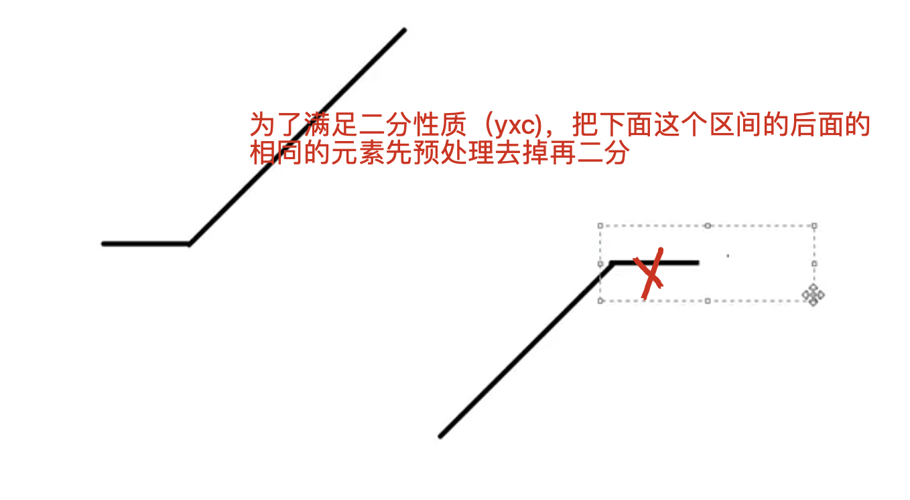

[[二分]] [[153.寻找旋转排序数组中的最小值]]
[acwing](https://www.acwing.com/problem/content/20/)

## 分析

为了使其后面都满足




## code
这里二分边界是和开始的元素比较
```c++
class Solution {
public:
    int findMin(vector<int>& nums) {
        int l = 0, r = nums.size() - 1;
        if(r < 0) return -1;
        
        while(r > 0 && nums[r] == nums[0]) r--;
        if(nums[r] >= nums[0]) return nums[0];
        while(l < r){
            int mid = l + r >> 1;
            if(nums[mid] < nums[0]) r = mid;
            else l = mid + 1;
        }
        return nums[r];
    }
};
```

- 升级版本：
以右端为边界，但是也要去除最后的重复元素
```c++
class Solution {
public:
    int findMin(vector<int>& nums) {
        int l = 0, r = nums.size() - 1;
        if(r < 0) return -1;
        
        while(r > 0 && nums[r] == nums[0]) r--;
  
        while(l < r){
            int mid = l + r >> 1;
            if(nums[mid] <= nums[r]) r = mid;
            else l = mid + 1;
        }
        return nums[r];
    }
};
```


​	

