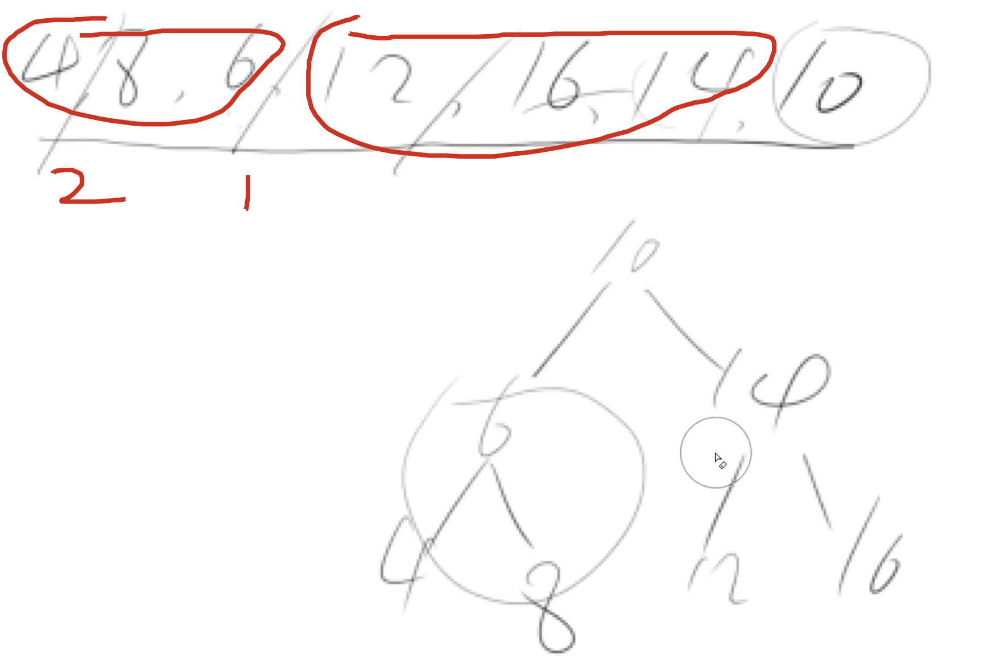

[[二叉树]] [[105.从前序与中序遍历序列构造二叉树]]

[leetcode](https://leetcode-cn.com/problems/er-cha-sou-suo-shu-de-hou-xu-bian-li-xu-lie-lcof/submissions/)
## 分析

1. 中序+后序来判断
因为这是二叉搜索树
已知后序，那我们排个序之后就是其中序遍历序列
按照中序+后序遍历的过程中，构造二叉树，如果能构造到最后即返回true
中间如果我们的后序序列中的左边树的后序序列中有比root大的值则不合法
2. 单个中序判断

一颗子树，找其根节点，然后从左到右找到第一个比根节点大的元素，然后看其后面是不是比根元素小的元素，有的话则返回false，没有就返回true

然后递归找下去

```c++
class Solution {
public:
    bool verifyPostorder(vector<int>& postorder) {
        int n = postorder.size() - 1;
        return dfs(postorder, 0, n);
    }
    bool dfs(vector<int> arr, int l, int r){
        if(l >= r) return true;
        int i = l;
        while(i < r && arr[i] < arr[r]) i++;
        for(int j = i; j < r; j++){
            if(arr[j] < arr[r]) return false;
        }
        // printf("%d %d %d\n", i, l, r);
        return dfs(arr, l, i - 1) && dfs(arr, i, r - 1); //注意这里下标错的话，全都错了
        return true;
    }
};
```





## code
```c++
class Solution {
public:
    struct Node{
        int val;
        Node *left, *right;
        Node(int x) : val(x), left(NULL), right(NULL) {}
    };
    unordered_map<int, int> mp;
    bool verifyPostorder(vector<int>& inorder) {
        auto post = inorder;
        int n = inorder.size();
        sort(inorder.begin(), inorder.end());
        for(int i = 0; i < n; i++) mp[inorder[i]] = i;
        return build(inorder, post, 0, n - 1, 0, n - 1);

    }
    bool build(vector<int>& inorder, vector<int>& postorder, int il, int ir, int pl, int pr){
        if(il > ir) return true;
        auto root = new Node(postorder[pr]);
        int k = mp[postorder[pr]];
        // 在后序队列的左边找找有没有比root大的值，因为下面两个build，postorder前后两部分都会在两个build中找，
        // 所以只要找前面是不是有比root大的即可，不用找后面小大
        for(int i = pl; i <= pl + k - 1 -il; i++){
            if(postorder[i] > postorder[pr]) return false;
        }
        return build(inorder, postorder, il, k - 1, pl, pl + k - 1 - il) && build(inorder, postorder, k + 1, ir, pl + k - il, pr - 1);
    }
};
```
