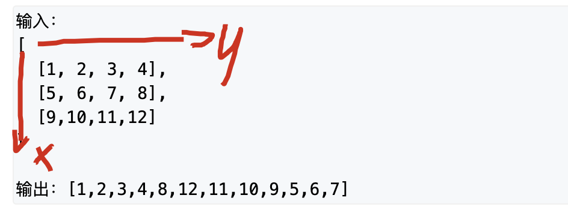

## 分析
有四个方向可以走，按照一个方向找到不能走为止(已经访问，到了结尾)，然后就换方向，直到走完所有到点
注意按照矩阵坐标：上往下是x轴，最多为行数，左往右是y轴，最多为列数


### 步骤
1. 判空
2. 四个方向准备，访问数组准备
3. 当前左边和当前方向
4. 访问所有的点，
	4.1. 标记访问
	4.2. 是否要换方向
	
## code
```c++
class Solution {
public:
    vector<int> printMatrix(vector<vector<int> > matrix) {
        if(matrix.empty() || matrix[0].empty()) return {};
        int m = matrix.size(), n = matrix[0].size();
        vector<int> ans;
        vector<vector<bool>> st(m, vector<bool>(n, false));
        const int dx[4] = {-1, 0, 1, 0}, dy[4] = {0, 1, 0, -1}; // 上右下左的顺序
        int x = 0, y = 0, d = 1; // d表示第一步对应的是dx中下标为1的方向，即右边
        
        for(int i = 0; i < n * m; i++){ // 把所有点都走一遍
            ans.push_back(matrix[x][y]);
            st[x][y] = true;
            int nx = x + dx[d], ny = y + dy[d];
            // 如果走到尽头了，就换方向
            if(nx < 0 || nx >= m || ny < 0 || ny >= n || st[nx][ny]){
                d = (d + 1) % 4;
                nx = x + dx[d], ny = y + dy[d];
            }
            x = nx, y = ny;
        }
        return ans;
    }
};
```
