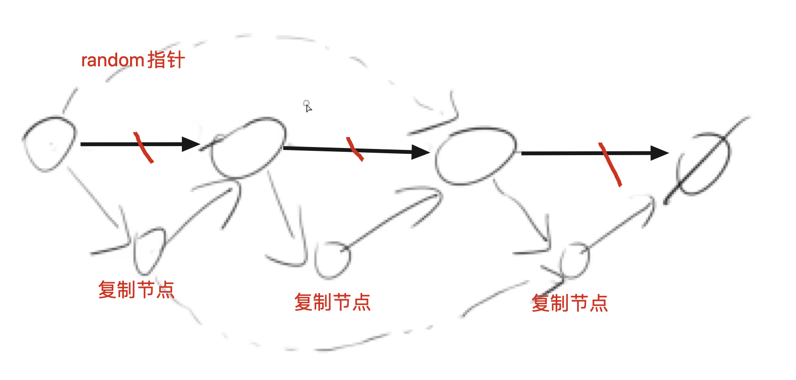

[acwing](https://www.acwing.com/problem/content/89/)
[lc](https://leetcode-cn.com/problems/fu-za-lian-biao-de-fu-zhi-lcof/)
[[链表]]
## 分析
1. 可以用map存下head节点对应的复制节点的值
2. 然后把head对应的next和random建立链接

这个空间复杂度是O(n)

### code
```c++
/**
 * Definition for singly-linked list with a random pointer.
 * struct ListNode {
 *     int val;
 *     ListNode *next, *random;
 *     ListNode(int x) : val(x), next(NULL), random(NULL) {}
 * };
 */
class Solution {
public:
    unordered_map<ListNode*, ListNode*> mp;
    ListNode *copyRandomList(ListNode *head) {
        for(auto p = head; p; p = p->next){
            auto ch = new ListNode(p->val);
            mp[p] = ch;
        }
        for(auto p = head; p; p = p->next){
            mp[p]->next = mp[p->next];
            mp[p]->random = mp[p->random];
        }
        return mp[head];
    }
    
};

```

## 分析2
这个没有创建新的节点：空间复杂度: O(1)
1. 在每个节点后放一个复制的节点
2. 调整每个复制节点的random指针
3. 用一个虚拟头节点，把其后面放cp节点，同时恢复现场


```c++
class Solution {
public:
    Node* copyRandomList(Node* head) {
        for(auto p = head; p;){
            auto cp = new Node(p->val);
            auto next = p->next;
            cp->next = p->next;
            p->next = cp;
            p = next;
        }
        for(auto p = head;p; p = p->next->next){
            if(p->random)
                p->next->random = p->random->next;
        }
        auto dummy = new Node(-1);
        auto cur = dummy; // 当前已经挪好位置的链表的尾节点在哪
        for(auto p = head; p;p = p->next){
            cur->next = p->next;
            cur = cur->next;
            p->next = cur->next;
            // p = p->next;
        }
        return dummy->next;
    }
};
```
