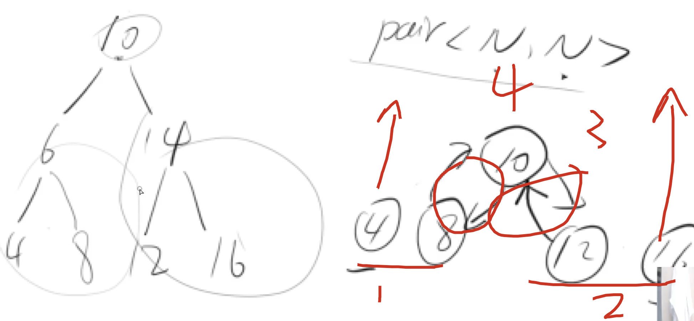

[acwing](https://www.acwing.com/problem/content/87/)
## 分析
1. 先拿出当前子树根节点
2. 递归其左右子树，返回对应子树的最左侧和最右侧节点
3. 把当前子树的根节点的的双向建立完毕，然后返回当前子树的最左侧和最右侧节点给上一级



特判：
1. 为叶子节点的时候
2. 左右节点都有时
3. 左节点为空时
4. 右节点为空时

## code
```c++
class Solution {
public:
    TreeNode* convert(TreeNode* root) {
        if(!root) return NULL;
        auto t = dfs(root);
        return t.first;
    }
    pair<TreeNode*, TreeNode*> dfs(TreeNode* root){
        if(!root->left && !root->right) return {root, root};
        if(root->left && root->right){
            auto lsides = dfs(root->left), rsides = dfs(root->right);
            root->left = lsides.second, root->right = rsides.first;
            lsides.second->right = root, rsides.first->left = root;
            return {lsides.first, rsides.second};
        }
        if(root->left){
            auto lsides = dfs(root->left);
            root->left = lsides.second;
            lsides.second->right = root;
            return {lsides.first, root};
        }
        if(root->right){
            auto rsides = dfs(root->right);
            root->right = rsides.first;
            rsides.first->left = root;
            return {root, rsides.second};
        }
    }
};
```

