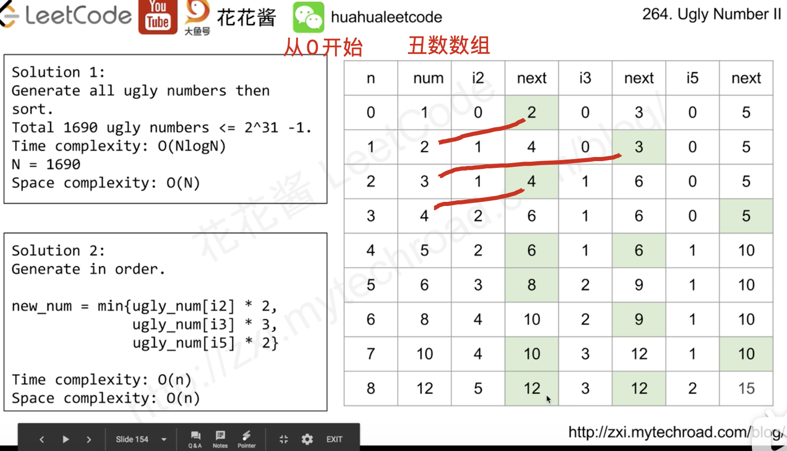

[花花酱的分析](https://zxi.mytechroad.com/blog/math/leetcode-264-ugly-number-ii/)
[lc题目](https://leetcode-cn.com/problems/ugly-number-ii/)
[acwing](https://www.acwing.com/problem/content/description/58/)
[acwing分析](https://www.acwing.com/solution/content/286/)
[[数学]] [[三指针]] [[归并]]
多路归并
## 分析
暴力法：生成所有的丑数
每一个丑数都是一个丑数乘上2 || 3 || 5得到的
且1是最开始的丑数，所以从1开始乘即可，三重循环，最后sort排序即答案
```c++
class Solution {
public:
    int nthUglyNumber(int n) {
        vector<int> nums;
        for (long a = 1; a <= INT_MAX; a *= 2)
            for (long b = a; b <= INT_MAX; b *= 3)
                for (long c = b; c <= INT_MAX; c *= 5)
                    nums.push_back(c);
        std::sort(nums.begin(), nums.end());        
        return nums[n - 1];
    }
};
```


三个指针（i5对应乘的数是5）

开始的时候都指向0，num[0]默认为1

后面第二个数，通过使用i2指针的位置从num数组取数，取出最小的之后，把对应的指针加一个位置，如果有多个相同的，就把对应的指针都++，防止重复


```c++
class Solution {
public:
    int getUglyNumber(int n) {
        vector<int> nums(1, 1);
        int i2 = 0, i3 = 0, i5 = 0;
        while(nums.size() < n){
            int next2 = nums[i2] * 2, next3 = nums[i3] * 3, next5 = nums[i5] * 5;
            int next = min(next2, min(next3, next5));
            nums.push_back(next);
            if(next == next2) ++i2;
            if(next == next3) ++i3;
            if(next == next5) ++i5;
        }
        return nums.back();
    }
};
```