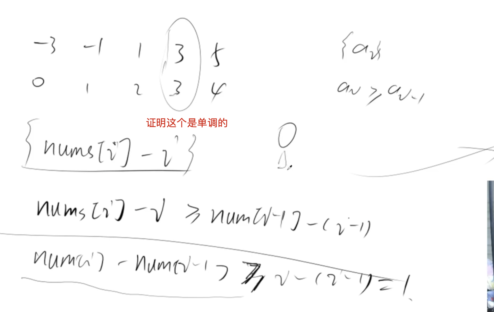

[[二分]]

[acwing](https://www.acwing.com/problem/content/description/65/)

## 分析

可以直接一个遍历即可

或者说使用`nums[i]-i`，经过证明其为单调

所以可以用二分来做



## code

```c++
class Solution {
public:
    int getNumberSameAsIndex(vector<int>& nums) {
        int l = 0, r = nums.size() - 1;
        while(l < r){
            int mid = (l + r) >> 1;
            if(nums[mid] - mid >= 0) r = mid;
            else l = mid + 1;
        }
        if(nums[l] - l == 0) return l;
        return -1;
    }
};
```