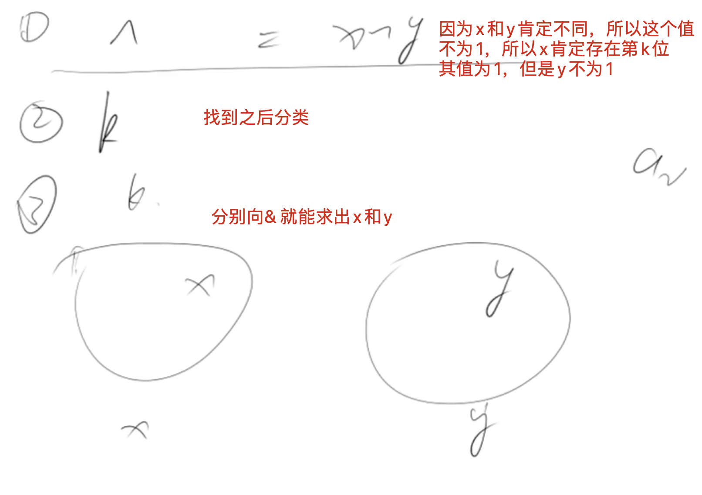

[acwing](https://www.acwing.com/problem/content/69/)
[[异或]]
一个整型数组里除了两个数字之外，其他的数字都出现了两次。
请写程序找出这两个只出现一次的数字。
## 分析
两个数，要想通过异或就出，就把其分为两个不同的集合（第k位是1和不是一的集合



## code

```c++
class Solution {
public:
    vector<int> findNumsAppearOnce(vector<int>& nums) {
        int first = 0, sum = 0;
        for(auto x : nums) sum ^= x;
        int k = 0;
        while(!(sum >> k & 1)) k++;
        for(auto x : nums)
            if(x >> k & 1) first ^= x;
        sum ^= first;
        return {first, sum};
    }
};
```