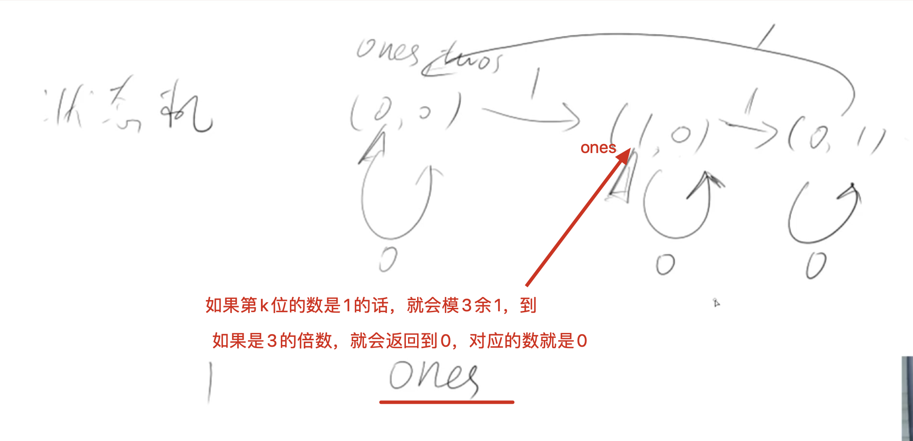

[[异或]]
[acwing](https://www.acwing.com/problem/content/70/)
在一个数组中除了一个数字只出现一次之外，其他数字都出现了三次。
请找出那个只出现一次的数字
## 分析
因为只有一个数只出现了一次，其他的数出现了3次，那么可以根据出现一次数来判断。
如果只出现一次数的`x`，其第`k`位为0，那么在第`k`位，0总共出现次数为3的倍数+1，即模3余1。
我们把每一位的个数进行求和，如果其最后的个数模3余1，那么第x位就是对应的数
注意：这里的时间复杂度表面：O(32n), 但是其实是n最大为`100万`，在这个情况下：`32 > logn`的，所以`32n > nlogn`，所以实际的时间复杂度为O(nlogn)

基本思想：
1. 还是统计x的每一位是0还是1
2. 所有的位运算，做的时候每一位之间都是独立做位运算的（`单个位运算完之后再结合出来`）. 我们给一位x做完运算之后，其实是其所有位都运算完，且只有一次
3. 我们只要把1的位置算出来即可，其他0的位置默认就是0～

- 状态机：知道这次的状态，可以预测下一个状态，这个状态机三次一循环，数组里三个相同的数字进行运算后回到初始状态。

One、two：`^  &  ~`



操作完之后，就会确认那个位是否为1，返回的ones其实就是个二进制数，对应的二进制位都为1了

```c++
class Solution {
public:
    int findNumberAppearingOnce(vector<int>& nums) {
        int ones = 0, twos = 0;
        for(auto x : nums){
            ones = (ones ^ x) & ~twos;
            twos = (twos ^ x) & ~ones;
        }
        return ones;
    }
};
```

