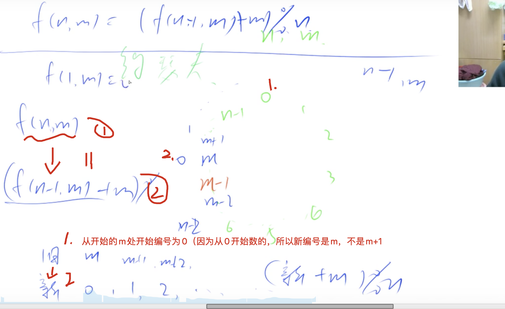

[约瑟夫问题]
[acwing](https://www.acwing.com/problem/content/78/)
## 分析
[[递推]]：寻求相邻两项的关系
`f(n, m)`表示，n个人，每次干掉m个后剩下的元素
`f(n, m) = (f(n - 1, m) + m) % n;` //因为每次都减少一个数，所以肯定都小于n

再找边界条件，f(1, m) = 0，剩下1个人，报m个号，选中的编号就是自己



## code
```c++
class Solution {
public:
    int lastRemaining(int n, int m) {
        if(n == 1) return 0;
        return (lastRemaining(n - 1, m) + m) % n;
    }
};
```