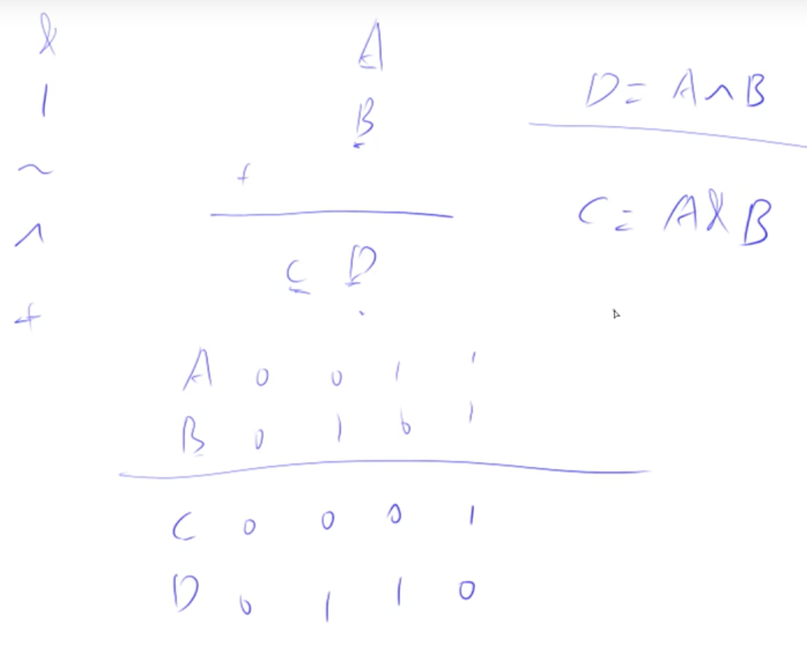
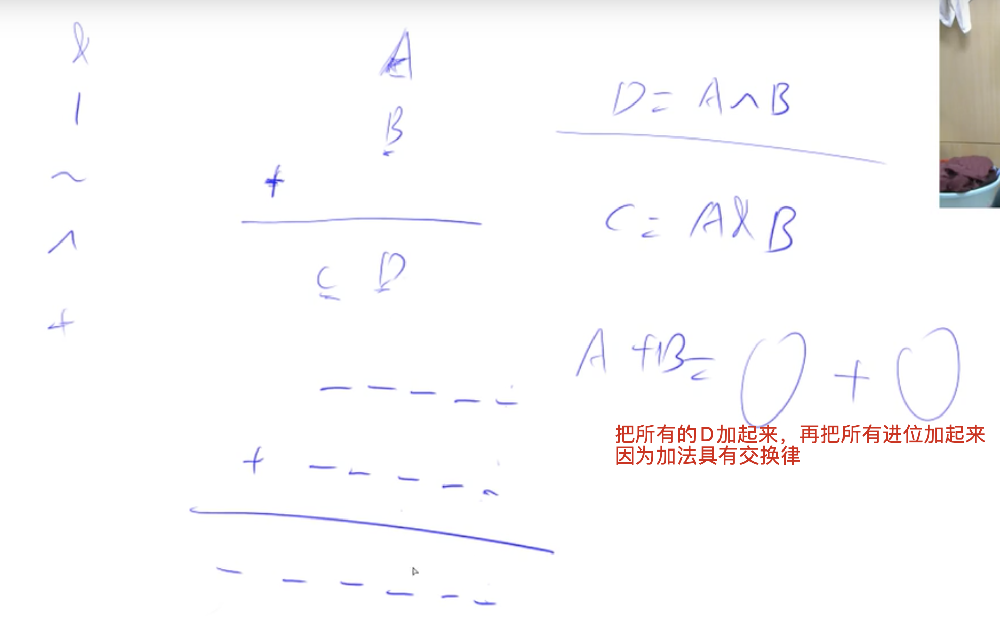
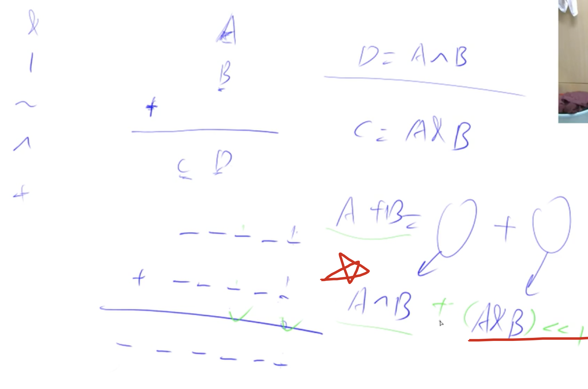

[acwing](https://www.acwing.com/problem/content/81/)
[[二进制]]

## 分析
负数不影响，因为补码的存在



加法有交换律：把所有单个位加起来，再把所有进位加起来



因为进位需要多一位，所以需要左移一位：`A ^ B + (A & B)`



## code

单独算单个位的和，还有进位的和。

num2是进位，肯定能结束循环的，why？

因为：假设num1和num2求进位之后有k个0，其左移只会多一个0，变成`k+1`个零。由于只有32位，当32位都是0的时候，就计算结束了

```c++
class Solution {
public:
    int add(int num1, int num2){
        while(num2){
            int sum = num1 ^ num2;
            int carry = (num1 & num2) << 1;
            num1 = sum;
            num2 = carry;
        }
        return num1;
    }
};
```

