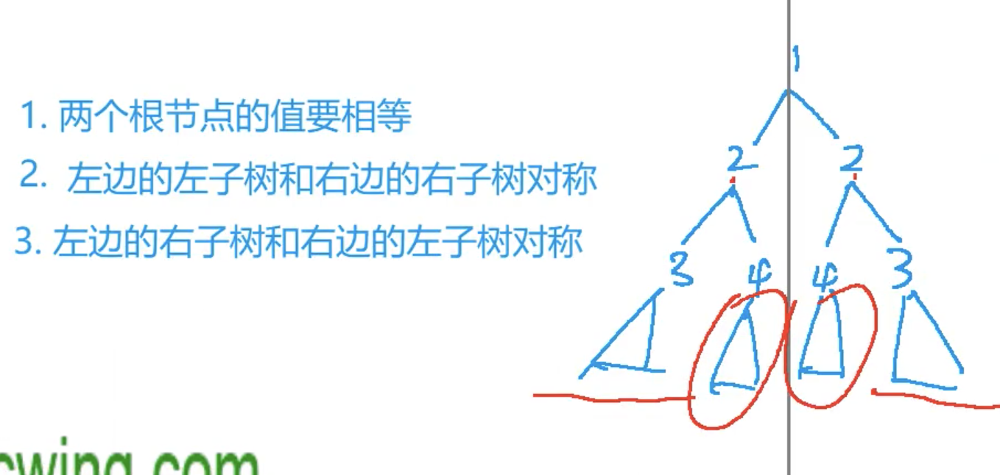

[[迭代]] [[二叉树]]

## 分析

对称二叉树分析（递归分析）

两边根节点要相同

左边的左子树和右边的右子树相同

左边的右子树和右边的左子树相同



## code

```c++
class Solution {
public:
    bool isSymmetric(TreeNode* root) {
        if(!root) return true;
        return dfs(root->left, root->right);
    }
    bool dfs(TreeNode *p, TreeNode *q){
        if(!p || !q) return !p && !q;
        return p->val == q->val && dfs(p->left, q->right) && dfs(p->right, q->left);
    }
};
```

## 迭代

由于是对称，那么左边的中序遍历，右边的 中序遍历相反对应的值就会一摸一样。使用中序遍历的迭代模式即可

```c++
class Solution {
public:
    bool isSymmetric(TreeNode* root) {
        if(!root) return true;
        stack<TreeNode*> left, right;
        auto p = root->left, q = root->right;
        while(p || q || left.size() || right.size()){
            // 理论上这个下去必须两个都为空
            while(p && q){
                left.push(p), right.push(q);
                p = p->left, q = q->right;
            }
            // 有一个为空为false
            if(p || q) return false;
            p = left.top(), left.pop();
            q = right.top(), right.pop();
            if(p->val != q->val) return false;
            p = p->right, q = q->left;
        }

        return true;
    }
};
```

