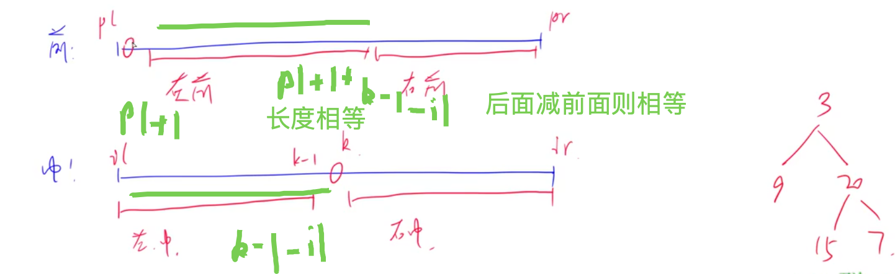

[[哈希表]]
[[二叉树]]
## 分析

[lc:前序+中序](https://leetcode-cn.com/problems/construct-binary-tree-from-preorder-and-inorder-traversal/)
[lc:中序+后序](https://leetcode-cn.com/problems/construct-binary-tree-from-inorder-and-postorder-traversal/submissions/)


1. 用一个哈希表直接把中序遍历的结果存起来，这样能直接找到对应根节点的位置
2. 求一个节点的前序遍历的时候，可以通过前序和中序的长度一样，[后面减前面一样]来直接获得结果

ps: 中序+后序代码差不多，只注意传入参数范围即可
[递归作用]：建立好对应树，然后返回对应根节点。
## code

```c++
class Solution {
public:
    unordered_map<int, int> pos;
    TreeNode* buildTree(vector<int>& preorder, vector<int>& inorder) {
        for(int i = 0; i < inorder.size(); i++) pos[inorder[i]] = i;
        return build(preorder, inorder, 0, preorder.size()-1, 0, inorder.size() - 1);
    }
    TreeNode* build(vector<int> preorder, vector<int> inorder, int pl, int pr, int il, int ir){
        if(pl > pr) return NULL;
        auto root = new TreeNode(preorder[pl]);
        int k = pos[preorder[pl]];
        root->left = build(preorder, inorder, pl + 1, pl+1+k-1-il, il, k - 1);
        root->right = build(preorder, inorder, pl+1+k-1-il + 1, pr, k + 1, ir);
        return root;
    }
};
```

## 中序+后序

```c++
class Solution {
public:
    unordered_map<int, int> ipos;
    TreeNode* buildTree(vector<int>& inorder, vector<int>& postorder) {
        for(int i = 0; i < inorder.size(); i++) ipos[inorder[i]] = i;
        return build(inorder, postorder, 0, inorder.size() - 1, 0, postorder.size() - 1);
    }
    TreeNode* build(vector<int> inorder, vector<int> postorder, int il, int ir, int bl, int br){
        if(bl > br) return NULL;
        auto root = new TreeNode(postorder[br]);
        int k = ipos[postorder[br]];
        root->left = build(inorder, postorder, il, k - 1, bl, bl + k-1-il);
        root->right = build(inorder, postorder, k + 1, ir, bl + k-il, br - 1);
        return root;
    }
};
```

