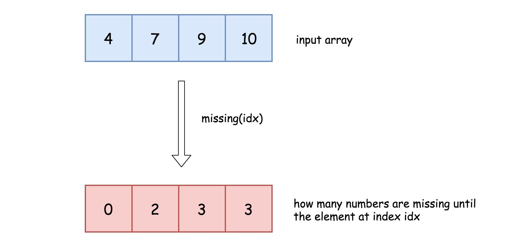
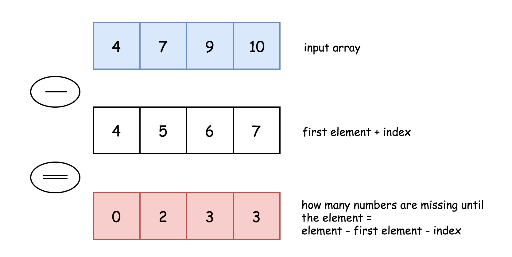

原文地址 [leetcode-cn.com](https://leetcode-cn.com/problems/missing-element-in-sorted-array/solution/you-xu-shu-zu-zhong-de-que-shi-yuan-su-by-leetcode/) 

https://leetcode-cn.com/problems/missing-element-in-sorted-array/solution/you-xu-shu-zu-zhong-de-que-shi-yuan-su-by-leetcode/

[1060lc](https://leetcode-cn.com/problems/missing-element-in-sorted-array/)

[[二分]]

1060有序数组中的缺失元素
==========


#### [1060.有序数组中的缺失元素](1060.%E6%9C%89%E5%BA%8F%E6%95%B0%E7%BB%84%E4%B8%AD%E7%9A%84%E7%BC%BA%E5%A4%B1%E5%85%83%E7%B4%A0.md#%E6%96%B9%E6%B3%95%E4%B8%80%EF%BC%9A%E7%BA%BF%E6%80%A7%E6%89%AB%E6%8F%8F)方法一：线性扫描

我们用函数 `missing(idx)` 表示到 `A[idx]` 为止总共缺失的数字个数，下图给出了一个例子，数组为 `[4, 7, 9, 10]`，缺失的数字为 `[5, 6, 8]`，到数组中的数字 `7, 9, 10` 为止缺失的数字个数分别为 `2, 3, 3` 个。



如果我们能得到所有的 `missing(idx)`，那么我们只要对其进行线性扫描就可以知道第 `K` 个缺失的数字了。具体来说，如果有 `missing(idx - 1) < K <= missing(idx)`，那么就说明，第 `K` 个缺失的数字在 `A[idx - 1]` 和 `A[idx]` 之间，并且它比 `A[idx - 1]` 大 `K - missing(idx)`。


而计算出所有 `missing(idx)` 的方法也很简单，从 `A[0]` 到 `A[idx]` 应该有 `A[idx] - A[0] + 1` 个数字，而实际上根据下标，只有 `idx + 1` 个数字，因此缺失的数字个数为上面两个式子之差，即 `A[idx] - A[0] - idx`。



*   Java
*   Python

```java
class Solution {
    // Return how many numbers are missing until nums[idx]
    int missing(int idx, int[] nums) {
        return nums[idx] - nums[0] - idx;
    }

    public int missingElement(int[] nums, int k) {
        int n = nums.length;
        // If kth missing number is larger than 
        // the last element of the array
        if (k > missing(n - 1, nums))
            return nums[n - 1] + k - missing(n - 1, nums);

        int idx = 1;
        // find idx such that 
        // missing(idx - 1) < k <= missing(idx)
        while (missing(idx, nums) < k) idx++;

        // kth missing number is larger than nums[idx - 1]
        // and smaller than nums[idx]
        return nums[idx - 1] + k - missing(idx - 1, nums);
    }
}
```

```python
class Solution:
    def missingElement(self, nums: List[int], k: int) -> int:
        # Return how many numbers are missing until nums[idx]
        missing = lambda idx: nums[idx] - nums[0] - idx
                
        n = len(nums)
        # If kth missing number is larger than 
        # the last element of the array
        if k > missing(n - 1):
            return nums[-1] + k - missing(n - 1) 

        idx = 1
        # find idx such that 
        # missing(idx - 1) < k <= missing(idx)
        while missing(idx) < k:
            idx += 1

        # kth missing number is larger than nums[idx - 1]
        # and smaller than nums[idx]
        return nums[idx - 1] + k - missing(idx - 1)
```

**复杂度分析**

*   时间复杂度：$O(N)O(N)$O(N)，最多只会遍历整个数组一次。
    
*   空间复杂度：$O(1)O(1)$O(1)。
    

#### [1060.有序数组中的缺失元素](1060.%E6%9C%89%E5%BA%8F%E6%95%B0%E7%BB%84%E4%B8%AD%E7%9A%84%E7%BC%BA%E5%A4%B1%E5%85%83%E7%B4%A0.md#%E6%96%B9%E6%B3%95%E4%BA%8C%EF%BC%9A%E4%BA%8C%E5%88%86%E6%9F%A5%E6%89%BE)方法二：二分查找

**分析**

在方法一中，我们是通过线性扫描的方法找到 `missing(idx - 1) < K <= missing(idx)` 对应的 `idx` 的。事实上，由于 `missing(idx)` 是单调不减的，我们可以通过二分查找的方法找到满足条件的 `idx`，并将时间复杂度降低到 $O(log⁡N)O(\log N)$O(logN)。


*   Java
*   Python

```java
class Solution {
  // Return how many numbers are missing until nums[idx]
  int missing(int idx, int[] nums) {
      return nums[idx] - nums[0] - idx;
  }

  public int missingElement(int[] nums, int k) {
      int n = nums.length;
      // If kth missing number is larger than 
      // the last element of the array
      if (k > missing(n - 1, nums))
          return nums[n - 1] + k - missing(n - 1, nums);

      int left = 0, right = n - 1, pivot;
      // find left = right index such that 
      // missing(left - 1) < k <= missing(left)
      while (left != right) {
          pivot = left + (right - left) / 2;

          if (missing(pivot, nums) < k) left = pivot + 1;
          else right = pivot;
      }

      // kth missing number is larger than nums[idx - 1]
      // and smaller than nums[idx]
      return nums[left - 1] + k - missing(left - 1, nums);
  }
}
```

```javascript
var missingElement = function(nums, k) {
    let missx = function(idx){
        return nums[idx] - nums[0] - idx
    }
    let n = nums.length - 1
    if(k > missx(n)) return nums[n] + k - missx(n)
    let l = 0, r = n
    while(l < r){
        let mid = (l + r) >> 1
        if(missx(mid) >= k) r = mid
        else l = mid + 1
    }
    // console.log(l)
    return nums[l - 1] + k - missx(l - 1)
}
```

js分析

由于miss(idx)数组单调递增。我们要找的是第一个大于等于k的值，然后用其下一个值来计算即可. 也可以找第一个小于目标元素的值

```javascript
var missingElement = function(nums, k) {
    let missx = function(idx){
        return nums[idx] - nums[0] - idx
    }
    let n = nums.length - 1
    if(k > missx(n)) return nums[n] + k - missx(n)
    let l = 0, r = n
    while(l < r){
        let mid = (l + r + 1) >> 1
        if(missx(mid) < k) l = mid
        else r = mid  - 1
    }
    // console.log(l)
    return nums[l] + k - missx(l)
}
```


**复杂度分析**

*   时间复杂度：$O(log⁡N)O(\log N)$O(logN)。
    
*   空间复杂度：$O(1)O(1)$O(1)。
    

