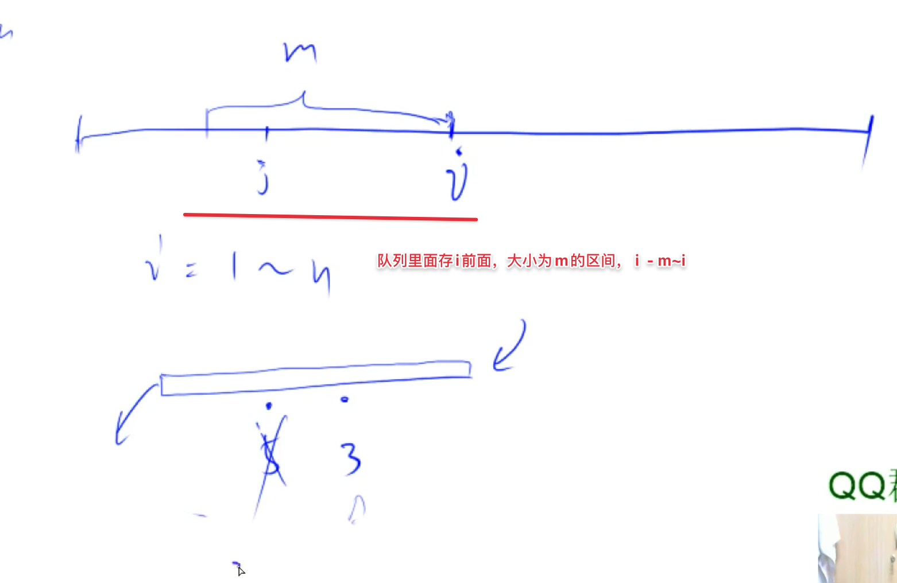

[acwing](https://www.acwing.com/problem/content/description/137/)
[[单调队列]]

## 题意

固定窗口内，最大的连续子数组的和是多少

## 分析
枚举每个连续子数组每一段的终点

[why]用单调队列：因为我们要枚举每个终点，然后终点往前走m个数字，然后从这些数字里面找最小的前缀和，因为i的前缀和是固定的，所以找到最小的，我们就找到了对应最大的前缀和。找窗口内最小的值，就是用单调队列



1. 用队列来维护集合：这里前m个元素
2. 把没用的值删除掉
3. 删除掉之后发现是单调的结构了
4. O(1)找出min或者max


1. 维护队列长度
2. 由于是遍历每个终点，则更新答案
3. 删除无用元素

由于用到了前缀和，我们还是用`i=1`开始计算的，且前缀和求一段的和都是用`s[i] - s[j - 1]`，我们的j都是从0开始的，其实也就是从第一个元素开始计算。我们是最后计算的，所以i最后加入n也没啥用，因为我们已经计算过了

## code

```c++
#include <iostream>
#include <queue>
#include <limits.h>
#include <vector>
typedef long long LL;

using namespace std;
int main(){
    LL n, m, ans = INT_MIN;
    cin >> n >> m;
    vector<LL> s(n + 1, 0);
    for(int i = 1; i <= n; i ++){
        cin >> s[i];
        s[i] += s[i - 1];
    }
    deque<LL> q;
    q.push_back(0);
    for(int i = 1; i <= n; i++){
      	// 注意由于i从1开始，我们这里实际q.front()实际是对应的上一个元素，或者说i里面其实已经+1了，所以这里可以不用再去加1了
        if(!q.empty() && i - m > q.front()) q.pop_front();
        ans = max(ans, s[i] - s[q.front()]);
        while(!q.empty() && s[q.back()] >= s[i]) q.pop_back();
        q.push_back(i);
    }
    cout << ans << endl;
    return 0;
}
```

