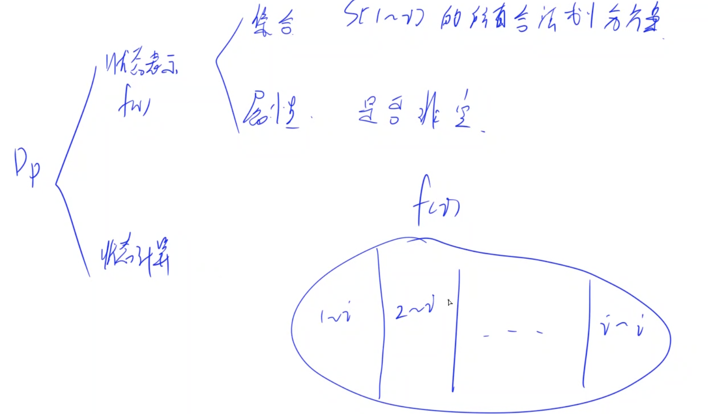
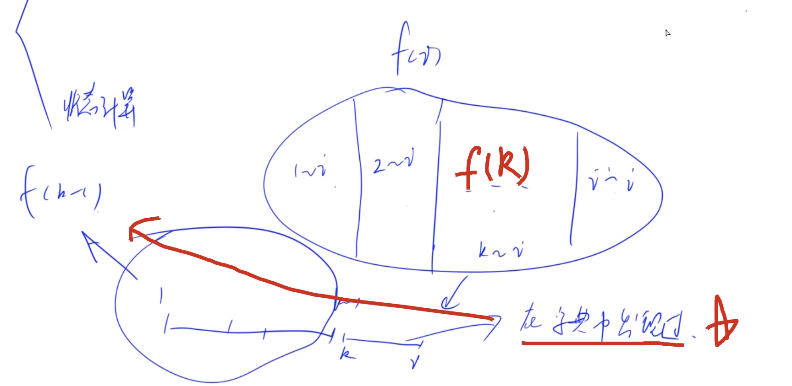
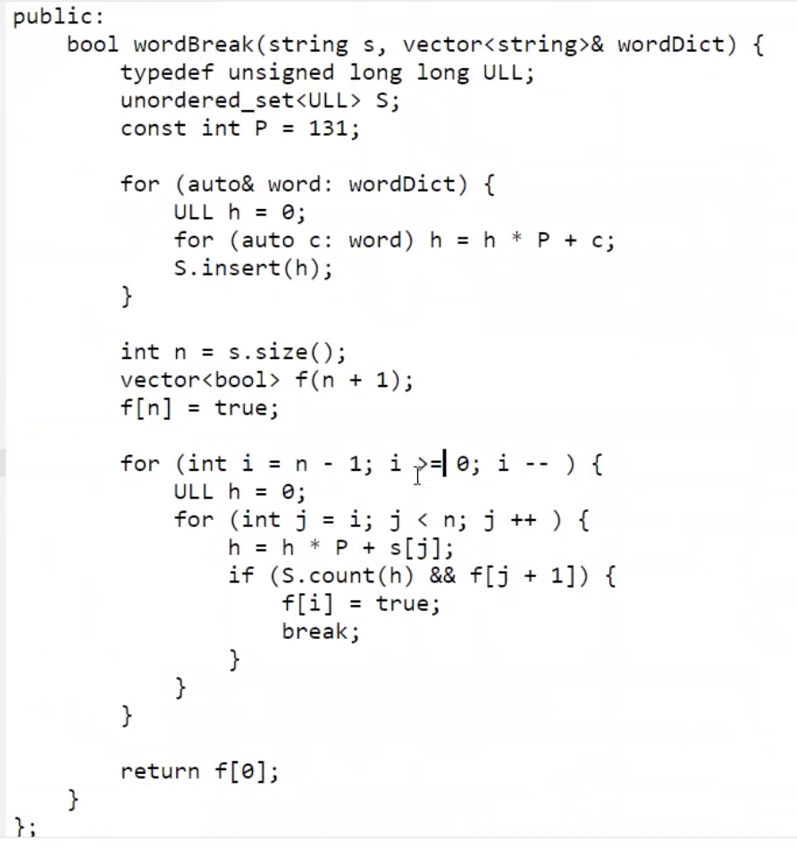
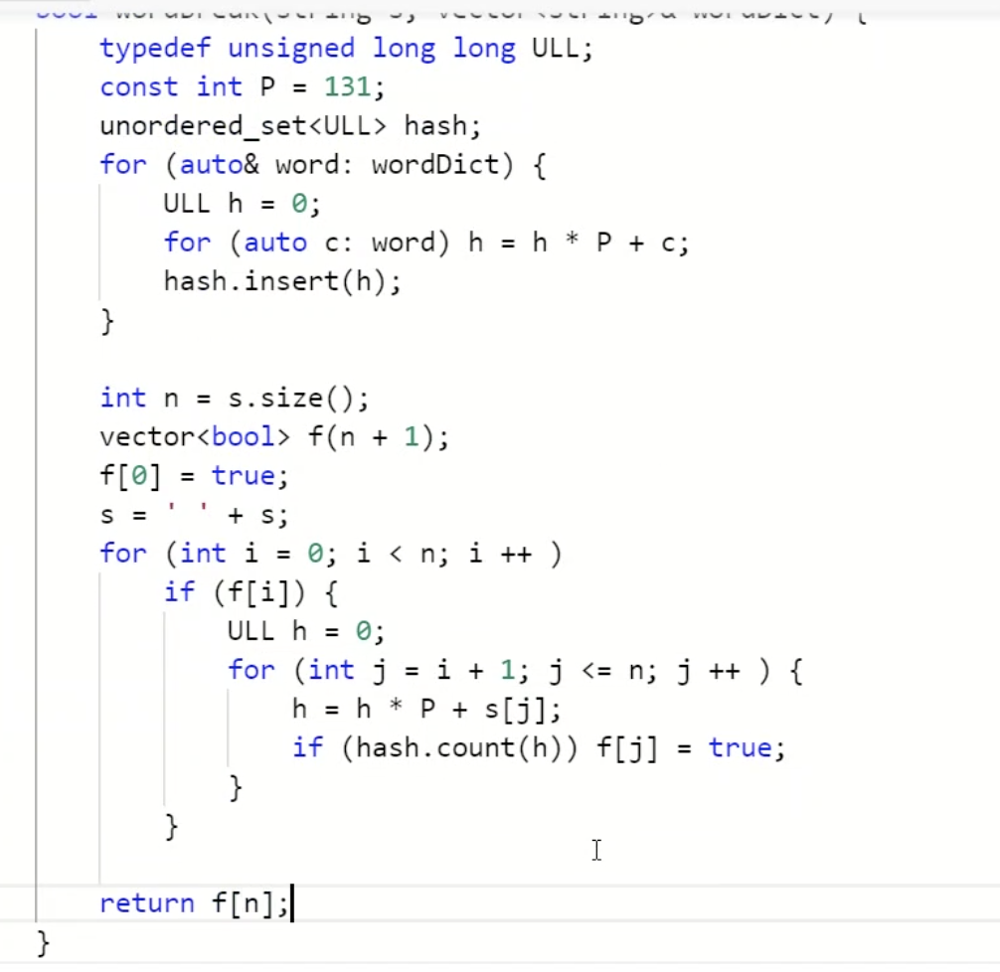

[lc](https://leetcode-cn.com/problems/word-break/)

[acwing](https://www.acwing.com/solution/content/233/)

[acwing solution](https://www.acwing	.com/video/1505/)

## 题意

给定单词能否有一种切分方式，使其部分均在词典中出现

下周一，牛客网

## 分析

1. 状态表示：f(i)表示，s(1~i)是否可以被拆分成若干部分，使得每一部分都可以在列表中出现过（划分s看其部分在字典中否，而不是从字典中往前找）。非空的意思就是：是否存在一个合法的划分方案
2. 状态计算：

 我们以最后一个单词的划分方式来分类，最后一个单词是`1~i`一类，`2~i`一类等等。

判断方式（状态转移）：只要有一个子集存在，那我们这个方案就是存在的

不妨设置最后一个划分方案是：f(k)

f(k)，两种划分方式，只要(k, i)在字典中出现过，我们后面只要看f(k - 1)是否出现过，就是转移到了下一个方案～（成功状态转移）

遍历--->找结尾

## code

这个是从后往前进行遍历。

状态表示为：f[i...n-1]能否切分符合要求

### code2

就是从一个f(i)出发，看看他能引申出哪些部分，然后等那些部分遍历过去的时候，继续看。（主要是这个把字符串转数字，可以一边乘一边加.

注意这里是从前面判断后面能否为true，所以最外面的循环不用`=n`, 如果有的话，第二层循环会代劳（开始到结束）

为什么给s添加一个空：因为我们需要一个默认为0的状态。这个是从第一个字符开始切割的，要不然我们只能从最后往前面，利用f[n]来做就不用加了	

