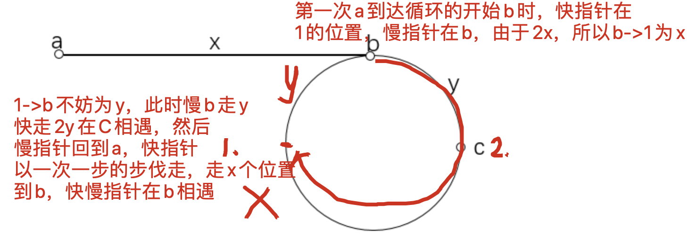

## 分析




## code

```c++
class Solution {
public:
    ListNode *detectCycle(ListNode *head) {
        auto p = head, q = head;
        // p是慢指针，q是快指针
        while(q){
            p = p->next;
            q = q->next;
            if(q) q = q->next;
            else break;
            if(p == q){
                p = head;
                while(p != q) q = q->next, p = p->next;
                return p;
            }
        }
        return NULL;
    }
};
```

