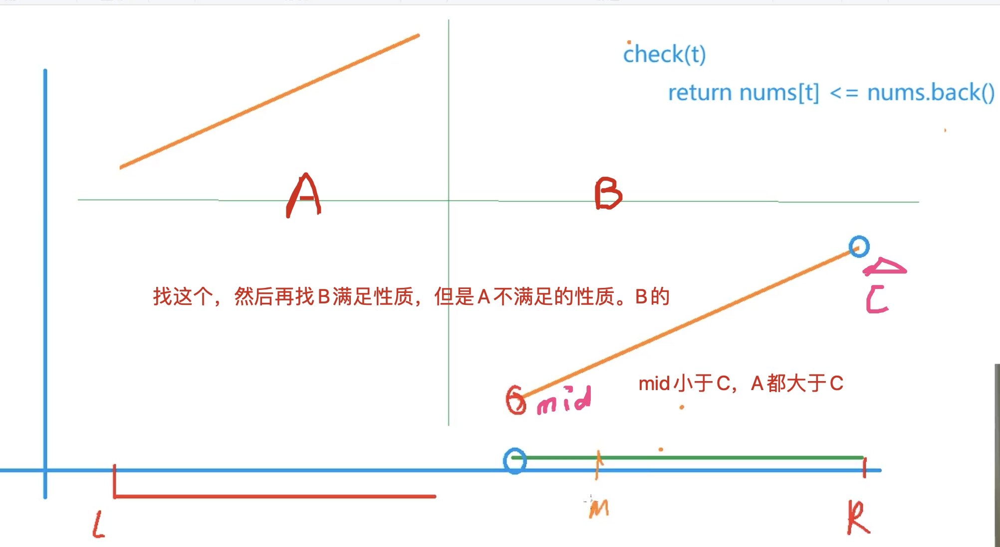

来源：[寻找最小值或者最大值](https://leetcode-cn.com/problems/find-minimum-in-rotated-sorted-array/)
[[二分]][[性质二分]]

思考步骤：

1. 二分区间
2. 编写框架：思考性质（把两部分现在的数组画出来，然后把性质表现出来）


且如下图，我们思考的也没有边界问题，因为当一个数组按照最后一个元素旋转的时候，数组还是不变的，还是符合B端的情况，所以还能找到最小值。




## 最小值代码

```c++
class Solution {
public:
    int findMin(vector<int>& nums) {
        int n = nums.size();
        if(nums[n-1] > nums[0]) return nums[0];
        int l = 0, r = n - 1;
        while(l < r){
            int mid = l + r >> 1;
            if(nums[mid] <= nums[r]) r = mid;
            else l = mid + 1;
        }
        return nums[l];
    }
};
```


找最大值的话，要找的答案在`A`部分的最上边，然后左边都大于A[l]，右边都小于A[l]，性质就找出来了


## 寻找最大值代码
```c++
class Solution {
public:
    int findMin(vector<int>& nums) {
        int n = nums.size();
        if(nums[n-1] > nums[0]) return nums[0];
        int l = 0, r = n - 1;
        while(l < r){
            int mid = l + r + 1>> 1;
            if(nums[mid] >= nums[l]) l = mid;
            else r = mid - 1;
        }
        return nums[l];
    }
};
```

