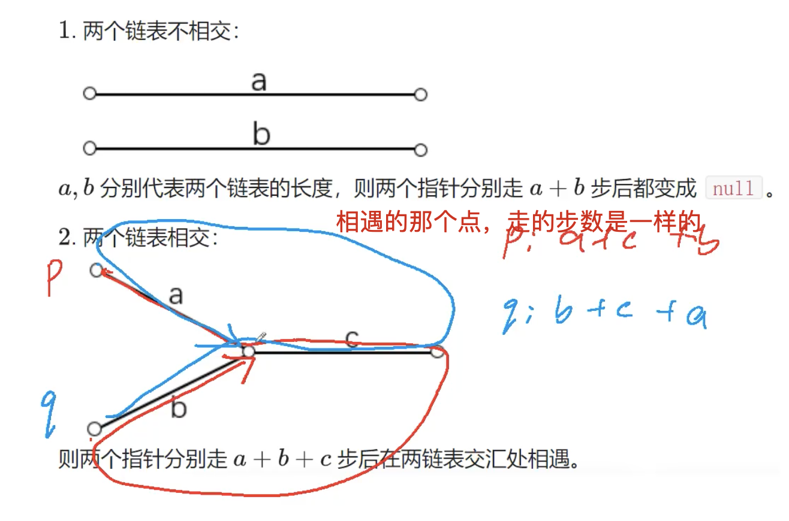

[[链表]]
技巧性
[acwing](https://www.acwing.com/solution/content/256/)



```c++
class Solution {
public:
    ListNode *getIntersectionNode(ListNode *headA, ListNode *headB) {
        ListNode *p = headA, *q = headB;
        while (p != q)
        {
            if (p) p = p->next;
            else p = headB;
            if (q) q = q->next;
            else q = headA;
        }
        return p;
    }
};
```

