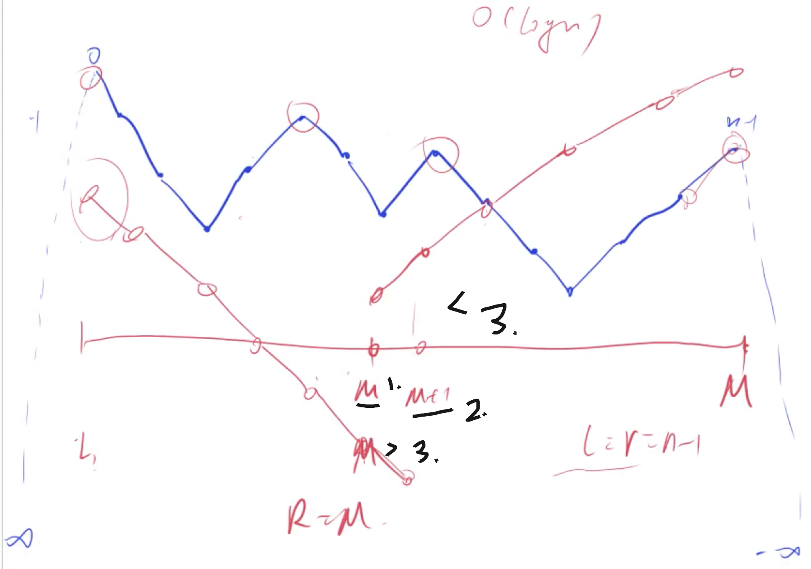
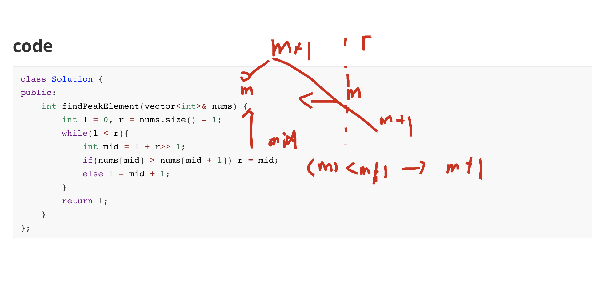

[[二分]]  [[特殊二分]]
[lc](https://leetcode-cn.com/problems/find-peak-element/)

特殊之处：别的二分都能有两端的性质，一部分内部都满足一个情况。而这5%没有，我们找不到这样的性质，但是我们每次可以把答案的范围缩小一半

## 画图分析



当我们的num[m] > num[m+1]的时候，我们左边肯定有个峰值的. 如果没有的话，就会选中最开始的位置，因为-1和n的位置都是无穷小。有的话就如下面分析。



上面是图。

边界情况讨论：mid+1有没有可能越界到n

当我们的mid为 n-1的时候。由于我们是向下取整的，这个时候，必定有`l = r = n-1 `(只有这样，才有可能mid = n - 1)，我们其实是没有这个可能进入循环的，当`l == r`的时候，已经退出循环了

## code

```c++
class Solution {
public:
    int findPeakElement(vector<int>& nums) {
        int l = 0, r = nums.size() - 1;
        while(l < r){
            int mid = l + r>> 1;
            if(nums[mid] > nums[mid + 1]) r = mid;
            else l = mid + 1;
        }
        return l;
    }
};
```


