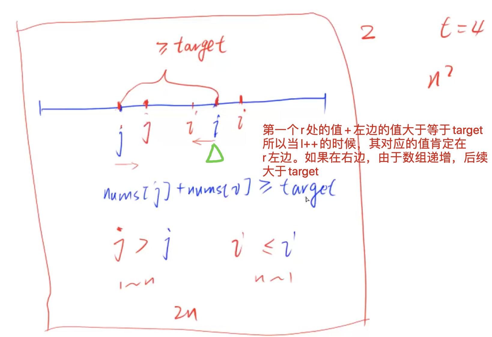

[[双指针]]
[lc](https://leetcode-cn.com/problems/two-sum-ii-input-array-is-sorted/)
[acwing分析](https://www.acwing.com/solution/content/306/)

## 思路
[[枚举终点]]，然后从终点往前找
暴力：两重循环，枚举所有的数对

优化：找到[l]指针对应的右边第一个大于等于target的[r]指针。`代码写的用到了r-1`，如果可以才往前走，那么退出循环的指针一定是在要求的位置的

还有不重复用一个元素要保证`r - 1 > l`

这样时间复杂度就是o(n)，虽然两个循环，但是两个指针遍历到相遇（注意这里肯定有答案）。




## code

```c++
class Solution {
public:
    vector<int> twoSum(vector<int>& numbers, int target) {
        vector<int> ans(2);
        for(int l = 0, r = numbers.size() - 1; l < numbers.size(); l++){
            // 要找到对应于l的最左边的r（第一个）大于等于target的值, 刚好r指向那个数，而没有向前多走一个位置
          	// r - 1 > l是为了不重复用一个元素，r > l的，r在之后可以走到r-1的位置，然后此时r == l
            while(r - 1 > l && numbers[r - 1] + numbers[l] >= target) r--;
            if(numbers[l] + numbers[r] == target) return {l + 1, r + 1};
        }
        return {-1, -1};
    }
};
```

