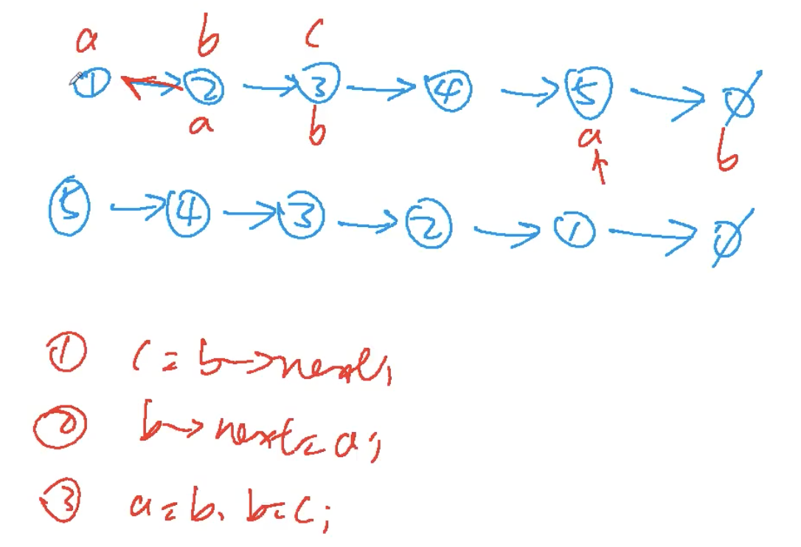
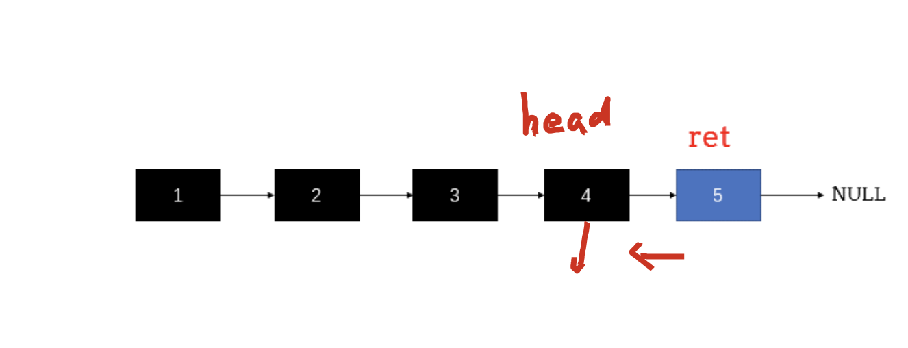

[[链表]]
[acwing](https://www.acwing.com/problem/content/33/)
## 迭代分析




## 迭代code
最后b结束，所以a在最后一个节点，也就是翻转的第一个节点
```c++
class Solution {
public:
    ListNode* reverseList(ListNode* head) {
        if(!head) return head;
        auto a = head, b = a->next;
        while(b){
            auto c= b->next;
            b->next = a;
            a = b, b = c;
        }
        head->next = NULL;
        return a;
    }
};
```

## 递归分析

1. 递归终止条件




## 递归code

```c++
class Solution {
public:
    ListNode* reverseList(ListNode* head) {
        if (head == NULL || head->next == NULL) {
            return head;
        }
        ListNode* ret = reverseList(head->next);
        head->next->next = head;
        head->next = NULL;
        return ret;
    }
};
```

