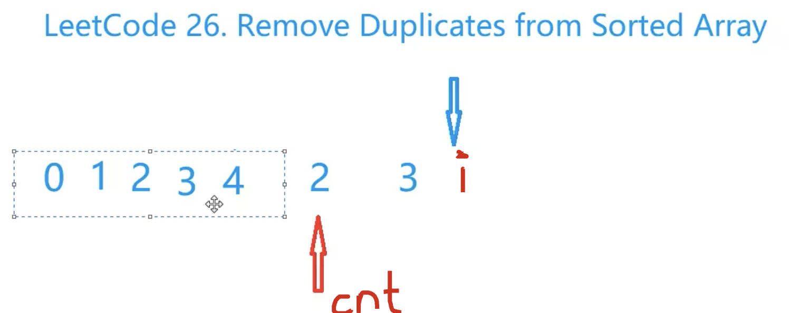

[lc](https://leetcode-cn.com/problems/remove-duplicates-from-sorted-array/)
[[双指针]]
## 分析

c++头文件下的`#include <algorithm>`下的`unique`函数[csdn](https://blog.csdn.net/u011992422/article/details/88976715)

作用：把一个数组（重复元素在附近）的不重复的元素放到数组的前面，然后返回一个数组最后一个不重复元素的位置

使用：一般的数组重复元素都是不在附近的，所以我们可以先排序，然后使用`unique`。


### 实现

双指针。心里要模拟一下，[`指针最后结束的位置在哪`]

开始，同时指向开头，右指针指向的是每个重复元素的最后一个



## code

数组加入的是最后一个重复的元素：双指针和上一个元素比较，

```c++
class Solution {
public:
    int removeDuplicates(vector<int>& nums) {
        int i = 0, cnt = 0;
        while(i < nums.size()){
            while(i + 1 < nums.size() && nums[i+1] == nums[i]) i++; // 结束时指针指向最后一个重复元素的位置
            nums[cnt++] = nums[i++];
        }
        return cnt;
    }
};
```

数组加入的是第一个重复的元素：可以和已经加入的元素进行比较，也可以和上一个元素进行比较

```c++
class Solution {
public:
    int removeDuplicates(vector<int>& nums) {
        int i = 0, cnt = 0;
        while(i < nums.size()){
            nums[cnt++] = nums[i];
            while(i + 1 < nums.size() && nums[i+1] == nums[cnt - 1]) i++; // 结束时指针指向最后一个重复元素的位置
            i++;
        }
        return cnt;
    }
};
```

使用`unique`

```c++
class Solution {
public:
    int removeDuplicates(vector<int>& nums) {
        return unique(nums.begin(), nums.end()) - nums.begin();
    }
};
```

