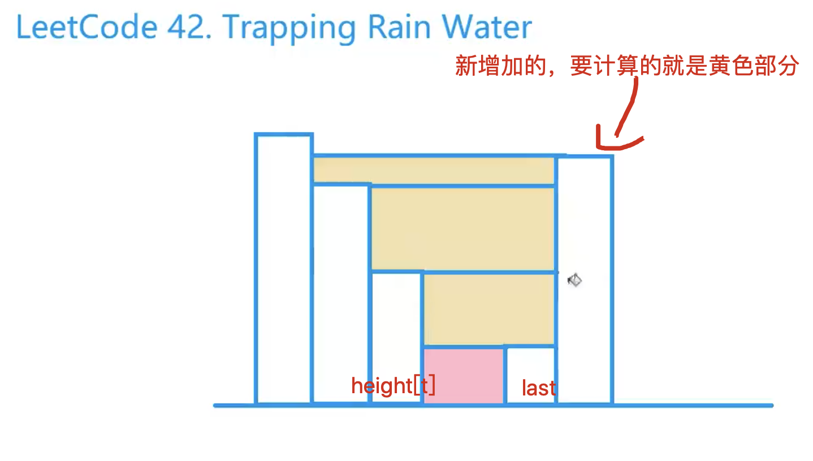

 [[单调栈]] [[前缀和]]
[acwing分析](https://www.acwing.com/solution/content/121/)

## 前缀和分析
[[155.最小栈]]
三次扫描: 按`列`进行分解的操作，每次把可以加的列都合并起来。每一列能装的水：`min(left_max[i], right_max[i]) - height[i];`，注意这里要减去本身

```c++
class Solution {
public:
    int trap(vector<int>& height) {
        int n = height.size(), ans = 0;
        if (n == 0)
            return 0;

        vector<int> left_max(n), right_max(n);

        left_max[0] = height[0];
        for (int i = 1; i < n; i++) 
            left_max[i] = max(left_max[i - 1], height[i]);

        right_max[n - 1] = height[n - 1];
        for (int i = n - 2; i >= 0; i--)
            right_max[i] = max(right_max[i + 1], height[i]);

        for (int i = 0; i < n; i++)
            ans += min(left_max[i], right_max[i]) - height[i];

        return ans;
    }
};
```


## 单调栈分析
和单调栈一般的用法关系不是很大


第一层细块由于下标为0比当前增加的要高，会退出循环，所以最后还要判断stk.size()，如果有的话，就要用当前高度减去last高度

## code

```c++
class Solution {
public:
    int trap(vector<int>& height) {
        int n = height.size(), res = 0;
        stack<int> stk;
        for(int i = 0; i < n; i++){
            int last = 0;
            while(stk.size() && height[stk.top()] <= height[i]){
                int t = stk.top();
                stk.pop();
                res += (i - t - 1) * (height[t] - last);
                last = height[t];
            }
            if(stk.size()) res += (i - stk.top() - 1) * (height[i] - last);
            stk.push(i);
        }
        return res;
    }
};
```

