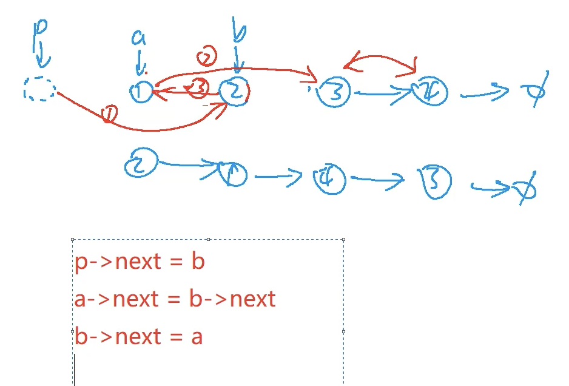
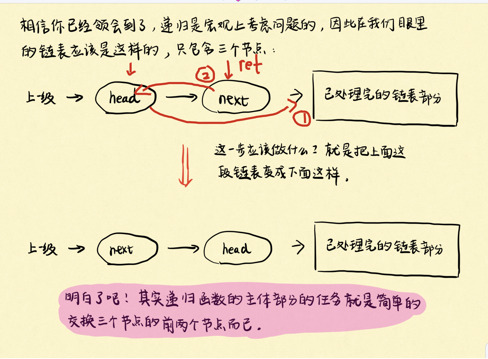

[[链表]] [[206.反转链表]]
[[递归]]

## 分析
画图: 分不清步骤的时候，就记下来；



## 三指针

```c++
class Solution {
public:
    ListNode* swapPairs(ListNode* head) {
        if(!head || !head->next) return head;
        auto dummy = new ListNode(-1);
        auto p = dummy;
        while(head && head->next){
            auto nxt = head->next;
            p->next = nxt, head->next = nxt->next, nxt->next = head;
            p = head;
            head = head->next;
        }
        return dummy->next;
    }
};
```


## 递归code

直接上三部曲模版：

1. **找终止条件。** 什么情况下递归终止？没得交换的时候，递归就终止了呗。因此当链表只剩一个节点或者没有节点的时候，自然递归就终止了。
2. **找返回值。** 我们希望向上一级递归返回什么信息？由于我们的目的是两两交换链表中相邻的节点，因此自然希望交换给上一级递归的是已经完成交换处理，即已经处理好的链表。
3. **本级递归应该做什么。** 结合第二步，看下图！由于只考虑本级递归，所以这个链表在我们眼里其实也就三个节点：head、head.next、已处理完的链表部分。而本级递归的任务也就是交换这3个节点中的前两个节点，就很easy了。




```c++
class Solution {
public:
 ListNode* swapPairs(ListNode* head) {
	 if(!head || !head->next) return head;
	 auto ret = head->next;
	 head->next = swapPairs(ret->next);
	 ret->next = head;
	 return ret;
 }
};
```

