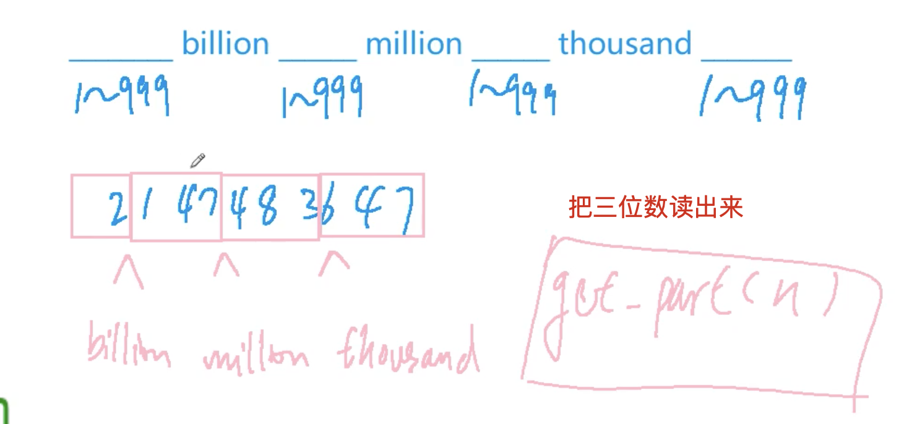

[[字符串]]
[lc](https://leetcode-cn.com/problems/integer-to-english-words/)

## 分析

英文是三位三位读的

传入的三位数单独读出来：先读出百、再读出[20及以上]的（因为11--19都有对应的单词），最后读出各位

三位三位读，使用`[1 000 000 000]`, 从高位往低位读，就是先用`num / i`，然后再`[%]`获得剩下的数



## code

```c++
class Solution {
public:
    string small[20] = {"Zero", "One", "Two", "Three", "Four", "Five", 
                               "Six", "Seven", "Eight", "Nine", "Ten", "Eleven", 
                               "Twelve", "Thirteen", "Fourteen", "Fifteen", 
                               "Sixteen", "Seventeen", "Eighteen", "Nineteen"};
    string decade[20] = {"", "", "Twenty", "Thirty", "Forty", "Fifty", "Sixty", 
                              "Seventy", "Eighty", "Ninety"};
    string big[4] = {"Billion", "Million", "Thousand", ""};
    string numberToWords(int num) {
        if(!num) return small[0];
        string res;
        for(int i = 1000000000, j = 0; i > 0; i /= 1000, j++){
            if(num >= i){
                res += get_part(num / i) + big[j] + ' ';
                num %= i;
            }
        }
        while(res.back() == ' ') res.pop_back();
        return res;
    }
  	// 读出传入的三位数
    string get_part(int num){
        string res;
        if(num > 99){
            res += small[num / 100] + " Hundred ";
            num %= 100;
        }
        if(!num) return res;
        if(num >= 20){
            res += decade[num / 10] + ' ';
            num %= 10;
        }
        if(!num) return res;
        res += small[num] + ' ';
        return res;

    }
};
```