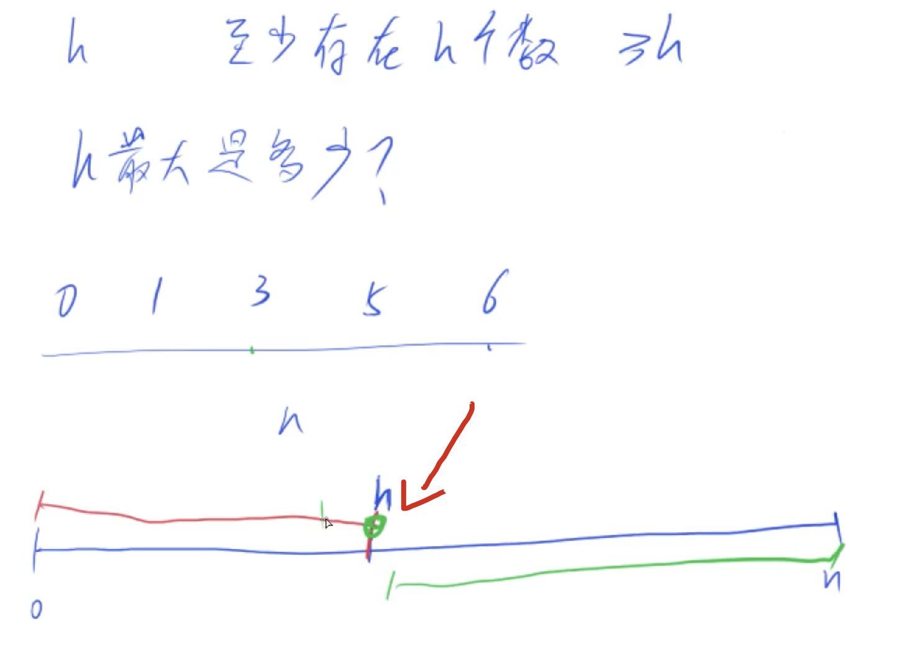

[[二分]][[性质二分]]
## 分析

确定范围，同时也要先确定[l和r的意义]，只有确定了意义才能确定范围

这里`l`和`r`的意义是有`h个数满足大于等于h`的的值, 那么这个r可以取n，为什么呢，因为我们可以所有的数都大于数组的大小，那么此时这个h取n。

性质分析：如果有h个数满足要求，那么从这h个数中取h-1个数出来，那么这h-1个数也必定大于h-1，因为他们已经大于h了，所以必定大于h-1，所以我们要找的是左边的端点，用模版一。因为左边的数都满足性质`至少有左边h个数大于等于自己`，而右边就没那么多了，所以可以二分。




## code

```C++
class Solution {
public:
    int hIndex(vector<int>& citations) {
        int n = citations.size();
        int l = 0, r = n;
        while(l < r){
            int mid = l + r + 1>> 1;
            if(citations[n - mid] >= mid) l = mid;
            else r = mid - 1;
        }
        return l;
    }
};
```

代码注意：这里if里面，用的n-mid，因为这个[n是数组的长度]，而不是数组最后一个元素的下标，所以没有-1，如果是下标就是[n - mid + 1]了