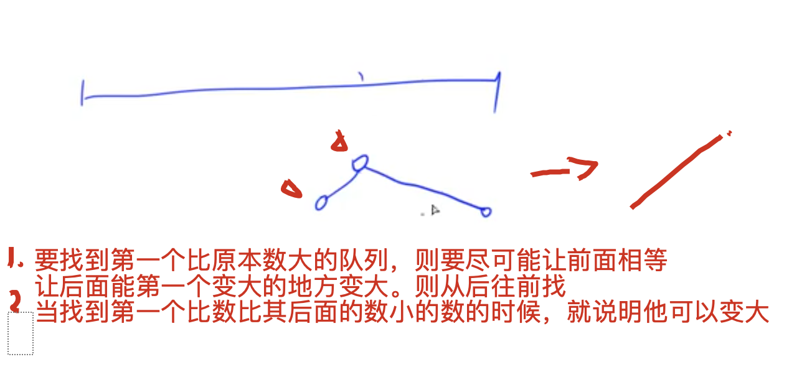

[lc](https://leetcode-cn.com/problems/next-permutation/)

[acwing分析](https://www.acwing.com/solution/LeetCode/content/103/)

数组规律题



1. 要找到第一个比原本数大的队列，则要尽可能让前面相等，则让后面能第一个变大的地方变大。则从后往前找

2. 当找到第一个比数比其后面的数小的数的时候，就说明他可以变大。则再从后往前找，找到第一个比他大的树（`因为我们第一步是找到第一个升序的地方，所以后面都是降序的，`）找到第一个比他大的地方，然后交换，也不影响数组的降序排列（因为一直在和要换的数比较，后面的数都比当前那个数小，前面的比他大）
3. 由于交换后的数的位置依旧是降序的，我们要找第一个比他大的，所以后面的数要变成升序的

## code

```c++
class Solution {
public:
    void nextPermutation(vector<int>& nums) {
        int j = -1, n = nums.size();
        for(int i = n - 2; i >= 0; i--)
            if(nums[i] < nums[i + 1]){
                j = i;
                break;
            }
        if(j == -1) reverse(nums.begin(), nums.end());
        else{
            for(int i = n - 1; i > j; i--){
                if(nums[i] > nums[j]){
                    swap(nums[i], nums[j]);
                    reverse(nums.begin() + j + 1, nums.end());
                    return;
                }
            }
        }
    }
};
```

