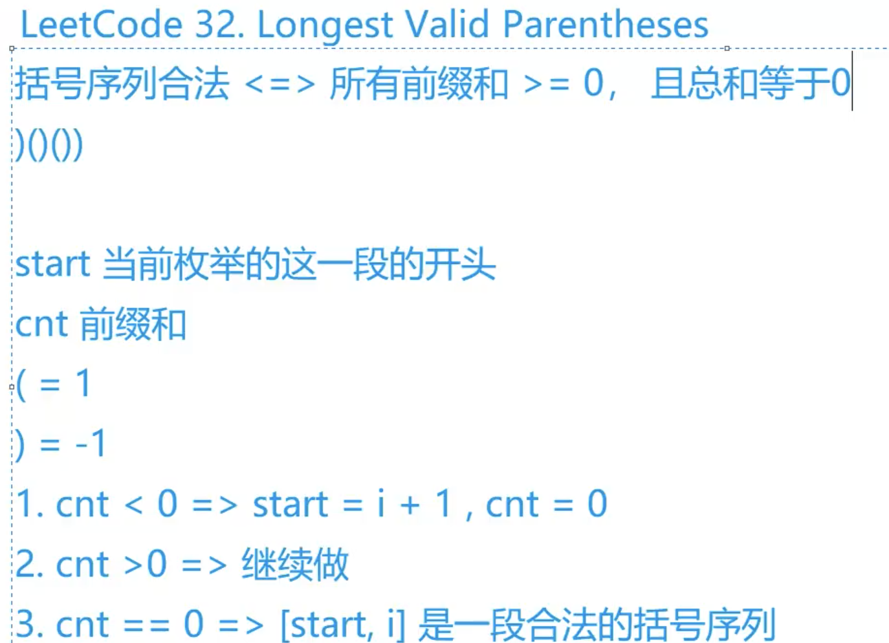

[有效括号](https://leetcode-cn.com/problems/valid-parentheses/)
字节笔试没做出来的耻辱柱
```c++
class Solution {
public:
    bool isValid(string s) {
        stack<char> stk;
        for(auto c : s){
            if(c == '(') stk.push(')');
            else if(c == '[') stk.push(']');
            else if(c == '{') stk.push('}');
            else if(stk.empty() || stk.top() != c)
            {
                	return false;
            }else if(!stk.empty() && stk.top() == c) stk.pop();
                
        }
        return stk.empty();
    }
};
```
[最长有效括号](https://leetcode-cn.com/problems/longest-valid-parentheses/)



## 分析

[acwing分析](https://www.acwing.com/solution/content/114/)

左括号：1，右括号：-1。他们两的ascii码只相差1，只要`与1进行异或运算`就能相互转化了
括号序列合法 <=> 所有前缀和>= 0, 且总和等于0
(()): 1 1 -1 -1 = 0
(() 11 -1 就不合法了

[重点]: 合法的是`>=0`，这样我们只能找到左边左括号大于等于右括号的情况：`((())`，这样一直不会进入循环，所以需要转化变成：`(()))`, 这样i在往后走的过程中就能找到有效子串了.(模仿`i指针`和`start指针`走的过程就能想明白)

## code

```c++
class Solution {
public:
    int res;
    void work(string s){
        for(int i = 0, start = 0, cnt = 0; i < s.size(); i++){
            if(s[i] == '(') cnt++;
            else{
                cnt --;
                if(cnt < 0) start = i + 1, cnt = 0;
                else if(!cnt) res = max(res, i - start + 1);
            }
        }
    }
    int longestValidParentheses(string s) {
        work(s);
        reverse(s.begin(), s.end());
        for(auto &c : s) c ^= 1; 
        work(s);
        return res;
    }
};
```

