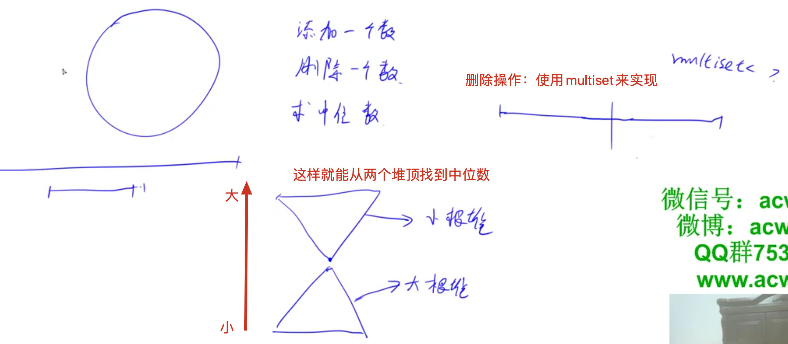

[滑动窗口中位数](https://leetcode-cn.com/problems/sliding-window-median/)
[[滑动窗口]] [[堆]]

[set与multiset区别](https://blog.csdn.net/xiajun07061225/article/details/7459206)

[acwing分析](https://www.acwing.com/solution/content/386/)

## 分析



Right: 小根，比左边多一个。

left：大根。获取最大值用：`rbegin()`

获取中位数：如果窗口是奇数，我们就返回右边的第一个数, 偶数就加起来除以2啦

维护两个堆：

	1. 插入到哪一边：和right先比较
 	2. 删除元素（窗口变大）：和right先比较
 	3. 维护两个堆的大小


## code

- 删除`rbegin()`元素, 不能直接erase，要先find之后才能删除
- find(1)和erase(1)的区别是，erase是把所有1删除，find是删除第一个元素

```c++
class Solution {
public:
    multiset<int> left, right;
    int k;
    double get_mudium(){
        if(k % 2) return *right.begin();
        else return ((double)*left.rbegin() + *right.begin())/2;
    }
    vector<double> medianSlidingWindow(vector<int>& nums, int _k) {
        k = _k;
        vector<double> ans;
        // 前k个元素处理
        for(int i = 0; i < k; i++){
            right.insert(nums[i]);
        }
        for(int i = 0; i < k/2; i++){
            left.insert(*right.begin());
            right.erase(right.begin());
        }
        ans.push_back(get_mudium());
        for(int i = k; i < nums.size(); i++){
            int ai = nums[i], ae = nums[i - k]; // 一个是待插入元素，一个是待删除元素
            if(ai >= *right.begin()) right.insert(ai);
            else left.insert(ai);
            if(ae >= *right.begin()) right.erase(right.find(ae));
            else left.erase(left.find(ae));
            // 插入之后调整两个堆大小
            while(left.size() > right.size()){
                right.insert(*left.rbegin());
                left.erase(left.find(*left.rbegin()));
            }
            while(right.size() > left.size() + 1){
                left.insert(*right.begin());
                right.erase(right.begin());
            }
            ans.push_back(get_mudium());
        }
        return ans;
    }
};
```

