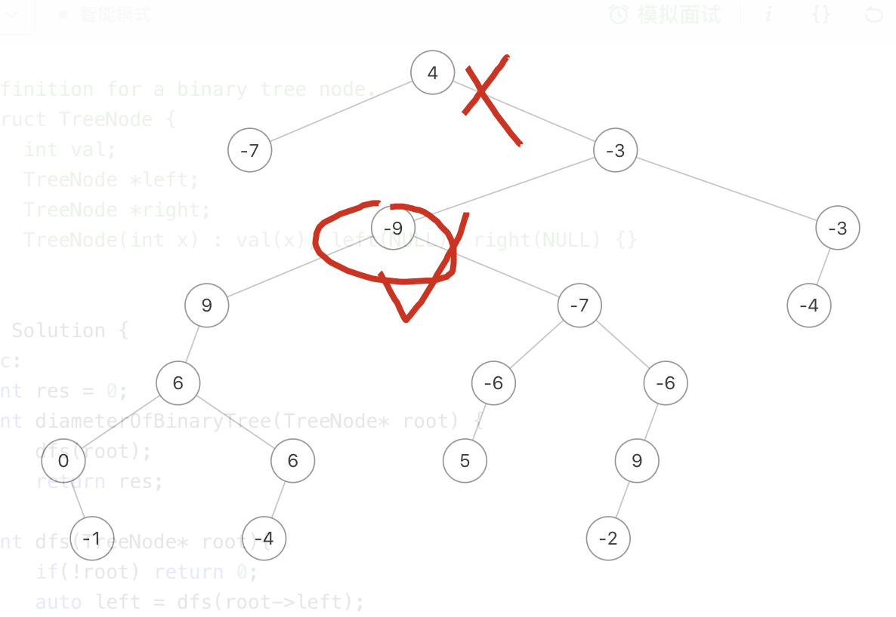
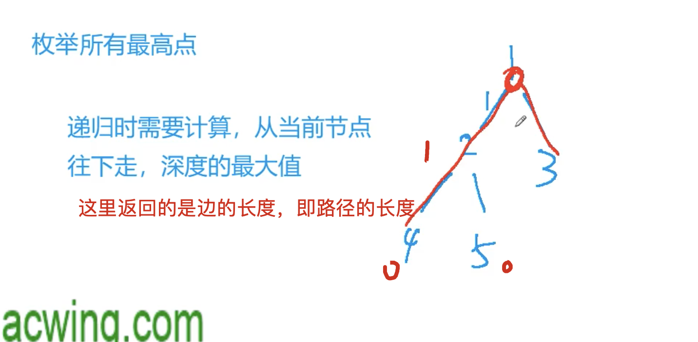

[[二叉树]] [[最高点]]

## 分析

每个点都可当作路径的最高点

我一开始把最高点默认为root了，所以导致出错

写代码的时候，在求边的数量的同时要更新全局的高度






## code

```c++
class Solution {
public:
    int res = 0;
    int diameterOfBinaryTree(TreeNode* root) {
        dfs(root);
        return res;
    }
    int dfs(TreeNode* root){
        if(!root) return 0;
        auto left = dfs(root->left);
        auto right = dfs(root->right);
        res = max(res, left + right);
        return max(left ,right) + 1;
    }
};
```

