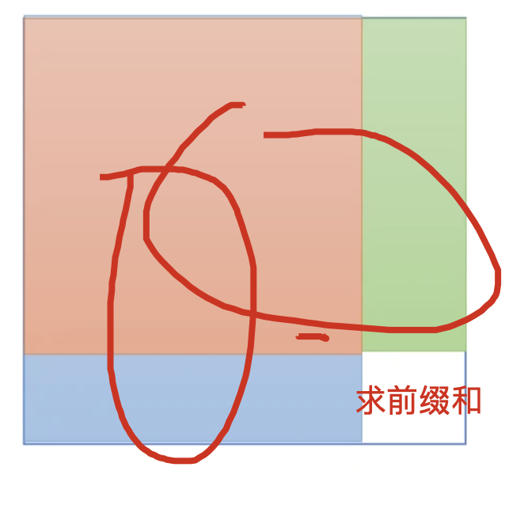
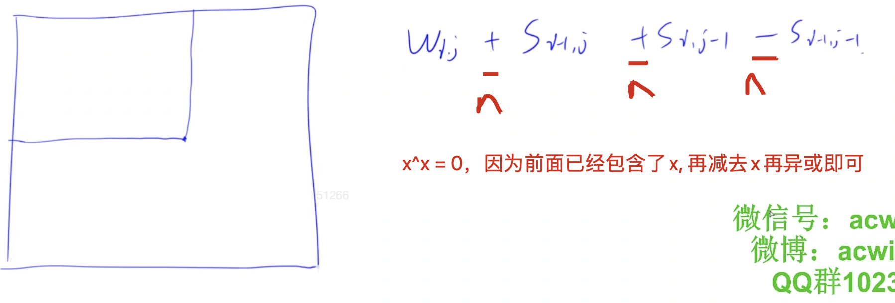

[lc225周赛](https://leetcode-cn.com/problems/find-kth-largest-xor-coordinate-value/)

[ithoughts](ithoughts://open?path=/Local/NutStore/215%20-%20ACwing/Acwing%E7%AE%97%E6%B3%95%E5%9F%BA%E7%A1%80%E8%AF%BE.itmz&topic=876FA843-D972-4775-A681-89A85EF880D7)
[nth_element](https://blog.csdn.net/xiaoquantouer/article/details/51591140)

## 题意分析
就是给出一个二维矩阵，每个下标除了给出的值，有一个可以求的值，那个可以求的值是其对应坐标的前缀和的值. 
正常的前缀和是加起来，这里是异或






### code

```c++
const int N = 1000010;

int q[N];

class Solution {
public:
    int kthLargestValue(vector<vector<int>>& w, int k) {
        int n = w.size(), m = w[0].size();
        int cnt = 0;
        for (int i = 0; i < n; i ++ ){
            for (int j = 0; j < m; j ++ ) {
                if (i) w[i][j] ^= w[i - 1][j];
                if (j) w[i][j] ^= w[i][j - 1];
                if (i && j) w[i][j] ^= w[i - 1][j - 1];
                q[cnt ++ ] = w[i][j];
            }
        }
        k = cnt - k; // 找第k个大的数，就是找第n-k个小的数
        nth_element(q, q + k, q + cnt); // 在algorithm头文件下，第1、3个参数就和sort一样，第二个加上你要第第k个数
        return q[k];
    }
};
```


