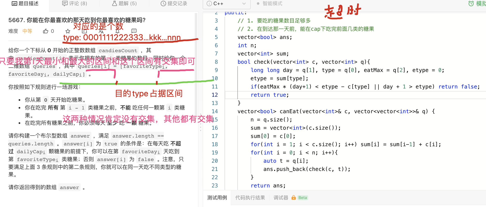

[lc](https://leetcode-cn.com/problems/can-you-eat-your-favorite-candy-on-your-favorite-day/)
[[前缀和]] [[区间]]
## 分析
[区间交叉]：有交集---->没有交集取反即可：[右区间比目的区间的左区间小] or [左区间比目的区间的左区间大]
1. 给出目前区间和目的区间
2. 进行比较

## code



我也不知道上面那个代码为什么会超时

```c++
class Solution {
public:
    // 1. 要吃的糖果数目足够多
    // 2. 在到达那一天前，能在cap下吃完前面几类的糖果
    typedef long long LL;
    bool check(LL l, LL r, LL dl, LL dr){
        if(l > dr || r < dl) return false;
        return true;
    }
    vector<bool> canEat(vector<int>& c, vector<vector<int>>& q) {
        int n = c.size();
        vector<bool> ans;
        vector<LL> sum(n + 1);
        for(int i = 1; i <= n; i++) sum[i] = sum[i-1] + c[i - 1];
        for(auto t : q){
            int day = t[1], per = t[2], type = t[0];
            ans.push_back(check(day + 1, (LL)(day + 1) * per,(LL)(sum[type] + 1), sum[type + 1]));
        }
        return ans;
    }
};
```

