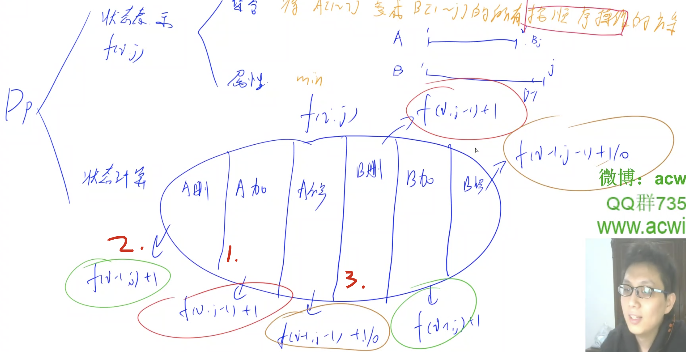

[[线性dp]]

## 分析

1. 不会做多余操作。比如把一个字符插入之后，又删除（平白无故多出两次操作）
2. 操作的顺序不会影响答案。abc ->bd. 先c->d还是先删除a答案都一样。（我们就可以在这个基础上，人为的定义一个顺序）

定义的时候下标从1开始：

将答案分成一个子集，然后从这些子集找到符合要求的属性即可（y式dp分析法）

[[f(i, j)]]: 表示将word1的[1, i]部分变成word2的[1,j]部分的所有操作集合，属性就是操作次数的最小值

那么其集合总共有六种情况：为什么是六种：因为总共有3种操作，且两个字符串，每个都是三种，则总共有6种情况



如图，虽然总共有六种情况，但是我们分析之后，其实只有3个表达式的～

时间复杂度：状态数量：n^2级别的，转移数量是3，所以是3n^2种

## code

```c++
var minDistance = function(s1, s2) {
    let m = s1.length, n = s2.length
    s1 = ' ' + s1, s2 = ' ' + s2
    let f = Array.from({length : m + 1}, _ => Array(n + 1).fill(0))
    for(let i = 0; i <= m; i++) f[i][0] = i;
    for(let j = 1; j <= n; j++) f[0][j] = j;

    for(let i = 1; i <= m; i++)
        for(let j = 1; j <= n; j++){
            f[i][j] = Math.min(f[i - 1][j], f[i][j - 1]) + 1
            let t = (s1[i] == s2[j] ? 0 : 1)
            f[i][j] = Math.min(f[i][j], f[i - 1][j - 1] + t)
        }
    return f[m][n]
};
```


