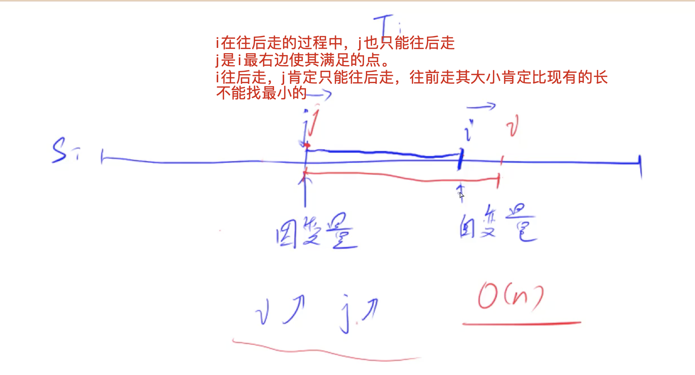

[[枚举终点]] [[滑动窗口]]
[lc](https://leetcode-cn.com/problems/minimum-window-substring/)

## 分析

[acwing分析](https://www.acwing.com/solution/content/160/)

如何快速一段里面是否有字符串t。
开一个hash表存储，
然后：遍历过程中，如果当前字符的hash是1，说明是要求的，计算个数，然后把其值-1为0（防止第二次遇到重复判断），因为整个过程没有给hash增加的过程，所以唯一

### 步骤：

一个hash表，遍历子串，表示对应子串需要的个数，hash表大小表示我们需要的总共字符种类

当右指针`i`经过的字符所需要的个数为1时，表示我们已满足一个字符的要求，`c++`

把`i`经过的字符要的个数`--`，表示已经消耗了一个

当我们的`c == cnt`时，表示j已经可以移动，如果`j`对应的个数要求是`-1`的话，表示其无关紧要，则移动`j`，直到遇到一个有用处的点。（这个地方就是求i对应的最远的j）

当我们的`c == cnt`时, 更新答案字符串。




## code

为`-1`为开始移动j（出现过两次），为0表示i不需要，但是j还需要。为1表示i需要单人solo。

`cnt`为开始移动`j指针`（左指针的信号）

`hash[s[i]] -- ;`

`while (c == cnt && hash[s[j]] < 0) hash[s[j ++ ]] ++ ;`

我怕的是遍历过程中，会因为t里面对重复一个数的计算，会让c变化。

s = "ADOBECODEB`ACC`DD", t = "ABC"

比如这里两个重复的C，会让c直接为cnt，为什么这里不会

对所有i经过的数都`减1`，当ABC都经过的时候c才为cnt的3.第一次cnt为3，i = 5, j = 0。这个时候j在A的位置，其值为0不执行while，要进入if判断

后续，当我的i到第二个`B`的时候，其B值减到-1，j不变，因为开始的A还是大于0，到了下一个A，其值变为`-1`，j开始移动到`下一个C`的位置(因为中间其他的值都减成`小于0`为`-1`了)，只有C出现了，暂时不需要。

```c++
class Solution {
public:
    string minWindow(string s, string t) {
        unordered_map<char, int> hash;
        int cnt = 0;
        for (auto c : t)
        {
            if (!hash[c]) cnt ++ ;
            hash[c] ++ ;
        }
        // hash表表示的是每个字母还缺多少
        string res = "";
        for (int i = 0, j = 0, c = 0; i < s.size(); i ++ )
        {
            // cout << c << endl;
            if (hash[s[i]] == 1) c ++ ; // 当前字母差一个就够了，就表示我们可以满足了一个新的字母
            hash[s[i]] -- ; // i到达则表明不缺，不缺的话就是--，其他无关紧要的数会直接变负数
            while (c == cnt && hash[s[j]] < 0) hash[s[j ++ ]] ++ ; // i不停往前走，j也是，往前走，j每次都会走到t字符串有的位置。
            if (c == cnt)
            {
                printf("%d %d %s %d\n", j, i, s.substr(j, i - j + 1).c_str(), hash['A']);
                if (res.empty() || res.size() > i - j + 1) res = s.substr(j, i - j + 1);
            }
        }

        return res;
    }
};
```

