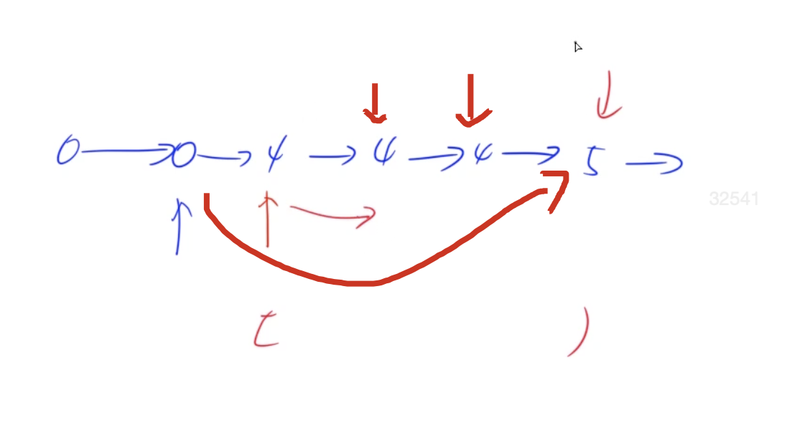

[[双指针]][[链表]]
[acwing](https://www.acwing.com/problem/content/description/27/)

## 分析

找相同的元素，双指针，看其next, 有下一段的时候，看其是否还有下一段的下一段，就是是否满足有2个以上值重复的条件，没有的话就直接遍历下一个呗。



## code
pre是要返回链表的尾节点（就是重复元素的前一个节点
n2是删除节点的下一个节点
```C++
class Solution {
public:
    ListNode* deleteDuplicates(ListNode* head) {
        auto dummy = new ListNode(-1);
        dummy->next = head;
        auto pre = dummy;
        while(pre->next){
            auto next2 = pre->next->next;
            while(next2 && next2->val == pre->next->val) next2 = next2->next;
            if(pre->next->next == next2) pre = pre->next;
            else pre->next = next2;
        }
        return dummy->next;
    }
};
```

pre是当前位置（相对pre->next下一段的pre，就是删除元素用的pre，我们删除的时候，主要看下一段是否有重复的，有就删），pre->next是下一段的第一个位置，next2是下一段的后续位置，如果`pre->next->next == next2`，表示下一段重复元素就一个，即`没有重复元素`，就直接把当前位置继续往后移动，负责就是有2个以上的重复位置，把其挪到第二个指针位置