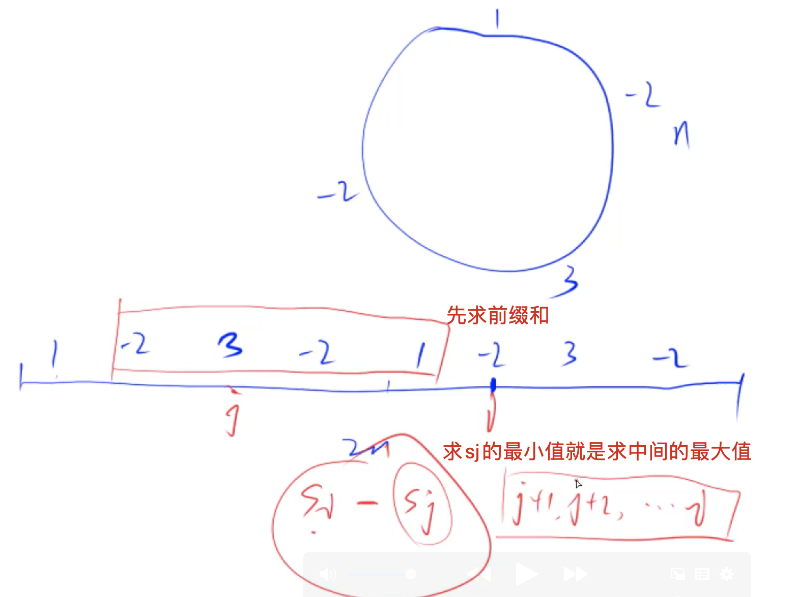

[[单调队列]] 
[[前缀和]] [[环]] [[142.环形链表2]]
[acwing分析](https://www.acwing.com/solution/content/564/)
## 分析
1. 环形的东西，可以后面再复制一遍，只能一遍。
2. 连续一个序列的最大和，可以用前缀和，从1开始
3. 双端队列需要先把0传入，表示前0个数的最小是0，值也是0（sum从下标1开始，下标0是0）
4. 因为环形数组的数只能用一次，所以单调队列必须维持在`n`的大小。
5. `i - n > q.front()` 为什么这里没有加1，因为我们默认给队列加了一个0，所以在比较的时候，要包括这个0，当我们要超过这个0的时候，就丢弃

简单题意梳理：
就是i指针往后走的过程中，我原本要遍历前面的数，来找到最小的前缀。现在只要把小的前缀都加入单调队列，直接输出即可。时间复杂度为O(n)



##  code

```c++
class Solution {
public:
    int maxSubarraySumCircular(vector<int>& A) {
        int n = A.size(), res = INT_MIN;
        for(int i = 0; i < n; i++) A.push_back(A[i]);
        vector<int> sum(2 * n + 1);
        for(int i = 1; i <= 2 * n; i++) sum[i] = sum[i-1] + A[i - 1]; //从1开始，所以A是i-1
        deque<int> q;
        q.push_back(0); // 前0个数的和为0，要先放入队列
        for(int i = 1; i <= 2*n; i++){
            if(q.size() && i - n > q.front()) q.pop_front();
            res = max(res, sum[i] - sum[q.front()]);
            while(q.size() && sum[i] <= sum[q.back()]) q.pop_back(); // 我们要找的是最小值，所以要加入的值更小则先加入
            q.push_back(i);
        }
        return res;
    }
};
```

