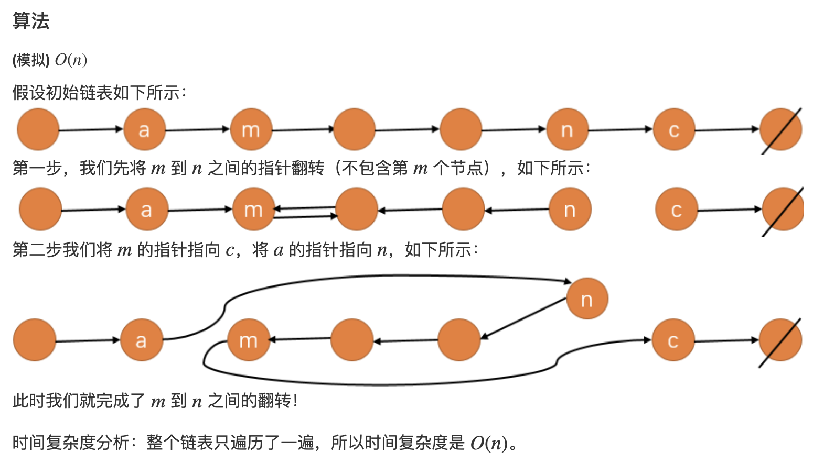

[LC](https://leetcode-cn.com/problems/reverse-linked-list-ii/)

[[链表]] [[206.反转链表]]

[ACwing题解](https://www.acwing.com/solution/content/174/)
## 题意
反转从位置 `m`到`n`的链表
## 模拟





## 模拟code

```c++
class Solution {
public:
    ListNode* reverseBetween(ListNode* head, int m, int n) {
        if(m == n) return head;
        auto d = new ListNode(-1);
        d->next = head;
        auto a = d, b = d;
        // 找m的前一个元素，因为需要知道m前一个和m，有dummy和无dummy找元素注意模拟一下
        for(int i = 0; i < m-1; i++) a = a->next; 
        // 找n这个元素，，需要知道n和n后面的元素
        for(int i = 0; i < n; i++) b = b->next;
        auto m1 = a->next, nn = b->next;
        for(auto p = m1, q = m1->next; q!=nn;){
            auto qn = q->next;
            q->next = p;
            p = q, q = qn;
        }
        a->next = b, m1->next = nn;
        return d->next;
    }
};
```

