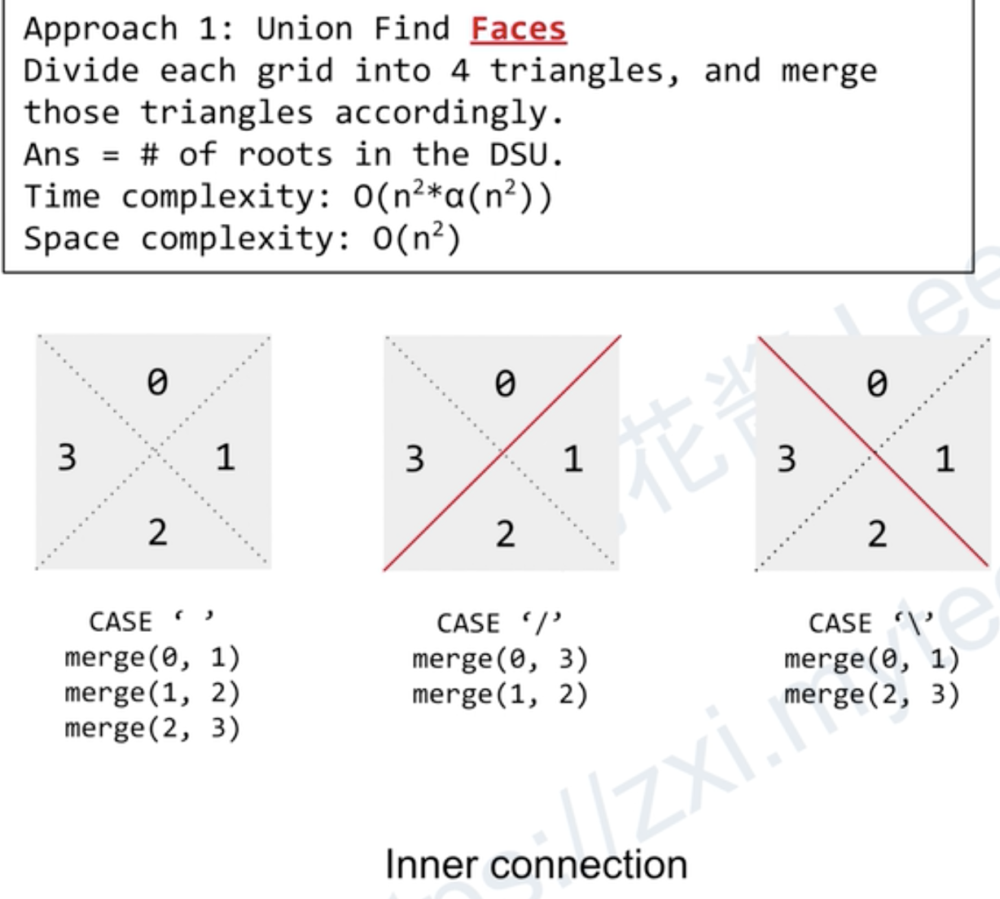
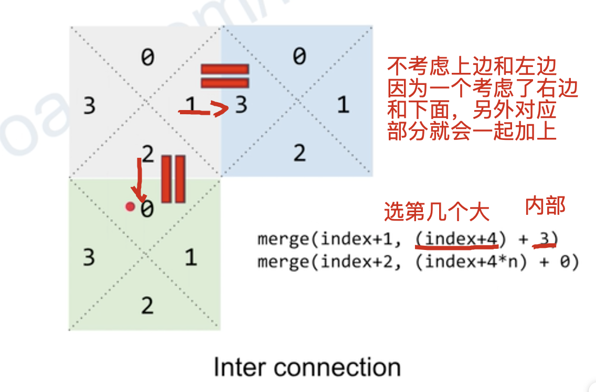

[lc](https://leetcode-cn.com/problems/regions-cut-by-slashes/)

## 分析

一开始题意理解不清楚：以为是给你几个1*1，问你怎么放，最多可以有几个区域

正确题意：给你一个grid，里面摆放的形式已经给你，然后问你现在有几个区域

[`难点`]：建模

给一个块分成四部分，然后对其编号






## code

```c++
class Solution {
public:
    vector<int> p;
    int find(int x){
        if(p[x] != x) p[x] = find(p[x]);
        return p[x];
    }
    void uni(int a, int b){
        p[find(a)] = find(b);
    }
    int regionsBySlashes(vector<string>& grid) {
        int n = grid.size(), res = 0;
        p = vector<int>(4*n*n);
        for(int i = 0; i < p.size(); i++) p[i] = i;
        for(int i = 0; i < n; i++)
            for(int j = 0; j < n; j++){
                // 每一个块的起始位置
                int index = 4 * (i * n + j);
                if(grid[i][j] == '/'){
                    uni(index + 0, index + 3);
                    uni(index + 1, index + 2);
                }else if(grid[i][j] == '\\'){
                    uni(index + 0, index + 1);
                    uni(index + 2, index + 3);
                }else{
                    uni(index + 0, index + 1), uni(index + 1, index + 2), uni(index + 2, index + 3);
                }
                // 块之间的合并，分别同一列的块合并, 上下两行的合并
                if(j + 1 < n) uni(index + 1, index + 4 + 3);
                if(i + 1 < n) uni(index + 2, index + 4 * n);
            }
        for(int i = 0; i < p.size(); i++) if(i == p[i]) res ++;
        return res;
    }
};
```

