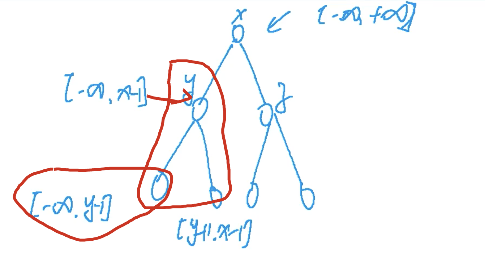

[[二叉树]] [[longlong]]
## 分析

自上往下，每次进入一个循环，先看看根节点是不是在范围内，然后再继续看其左右节点是否在范围内

递归树的话：到达递归叶节点就是有结果了。

以前对递归的理解：最后都返回true，中间所有过程都是true，现在：到达叶节点。



## code

```c++
class Solution {
public:
    bool isValidBST(TreeNode* root) {
        return dfs(root, INT_MIN, INT_MAX);
    }
    // 不是long long的话，-1和+1的INT最小值和最大值会溢出
    bool dfs(TreeNode* root, long long minv, long long maxv){
        // 到叶节点才返回true
        if(!root) return true;
        // 上往下就先看节点的值，再进行遍历
        if(root->val < minv || root->val > maxv) return false;
        return dfs(root->left, minv, root->val - 1ll) && dfs(root->right, root->val + 1ll, maxv);
    }
};
```

`1ll`一个int类型和一个long long类型的值运算会得到一个long long的值

下题也是上往下来做的

```c++
class Solution {
public:
    bool isValidBST(TreeNode* root) {

        return dfs(root,nullptr,nullptr);
    }

    bool dfs(TreeNode* root, TreeNode* min, TreeNode* max){
        if(root==nullptr){
            return true;
        }
        if(min!=nullptr && root->val <= min->val){ // check right child
            return false; 
        }
        if(max!=nullptr && root->val >= max->val){ // check left child 
            return false; 
        }
        return dfs(root->left, min, root) && dfs(root->right,root, max);
    }
};
```

