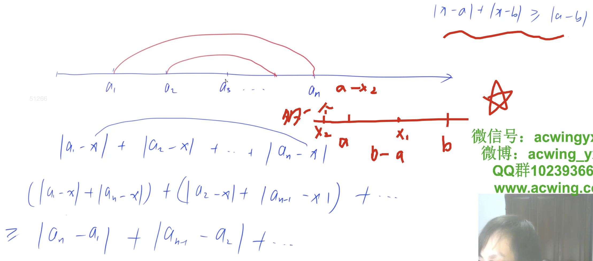

[acwing](https://www.acwing.com/problem/content/description/106/)
`|x-a| + |x-b| >= |b-a|`
[[中位数]] [[最小距离]]



由上图可知

### code
```c++
#include <iostream>
#include <algorithm>
using namespace std;
const int N = 1e5 + 10;
int arr[N];
int main(){
    int n, ans = 0;
    cin >> n;
    for(int i = 0; i < n; i++) cin >> arr[i];
    sort(arr, arr + n);
    for(int i = 0; i < n >> 1; i++) ans += (arr[n-1-i] - arr[i]);//1
    cout << ans;
    return 0;
}
```

1处可替换为：abs(arr(i) - arr(n/2))就是单独计算每一个点到x放到距离，我那个直接算了一组点的距离之和