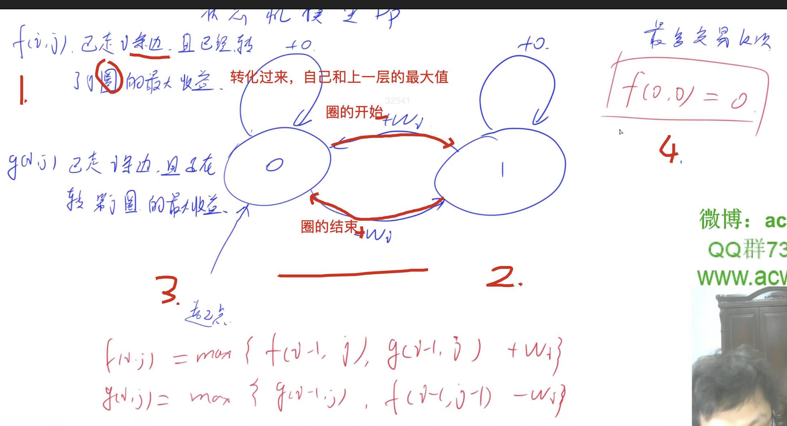
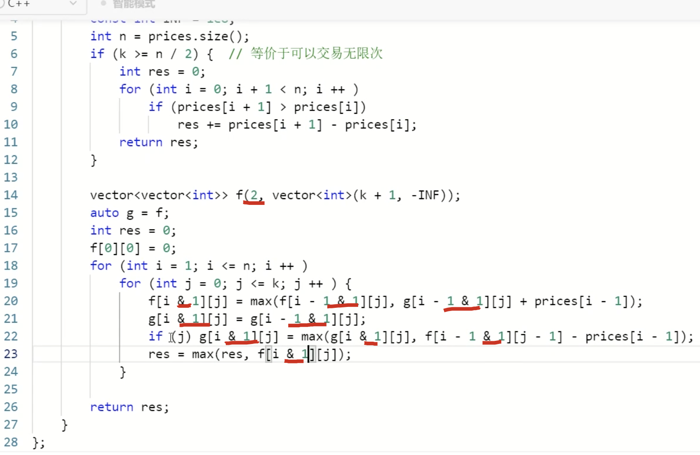

[[买卖股票]]

[[状态机模型]]

1. 状态表示
2. 状态计算
3. 找入口
4. 边界条件



求当前的f(i, j)，找最后一步的不同，就是上一步，上一步就是上一层，上一层本来就没卖出，上一层然后卖出了，所以就把圈回退到上一步持有股票的情况，持有股票然后现在卖出，因为还是在同一圈中，所以j是不变的，然后加上`w[i]`

### 代码

```c++
class Solution {
public:
    int maxProfit(int k, vector<int>& prices) {
        int n = prices.size();
        const int INF = 1e8;
        int res = 0;
        if(k >= n/2){
            for(int i = 0; i + 1 < n; i++){
                if(prices[i+1] > prices[i]) res +=prices[i+1]- prices[i];
            }
            return res;
        }
        vector<vector<int>> f0(n+1, vector<int>(k+1, -INF));
        // 创建两个的话，除非分开写，不能写在一行，要不然就这样赋值
        auto f1 = f0;
        f0[0][0] = 0;
        // 因为下面有i-1，所以我们下标从1开始，w[i] = prices[i-1]
        for(int i = 1; i <= n; i++){
            for(int j = 0; j <= k; j++){
                f0[i][j] = max(f0[i-1][j], f1[i-1][j] + prices[i-1]);
                f1[i][j] = f1[i-1][j];
                if(j) f1[i][j] = max(f1[i][j], f0[i-1][j-1] - prices[i-1]);
                if(f0[i][j] > res) res = f0[i][j];
            }
        }
        return res;
    }
};
```


## [[滚动数组]]

### 优化条件

用到的只和上一层有关

### 优化方法

把开辟的数组变成2，然后把所有第一维的`&1`即可




