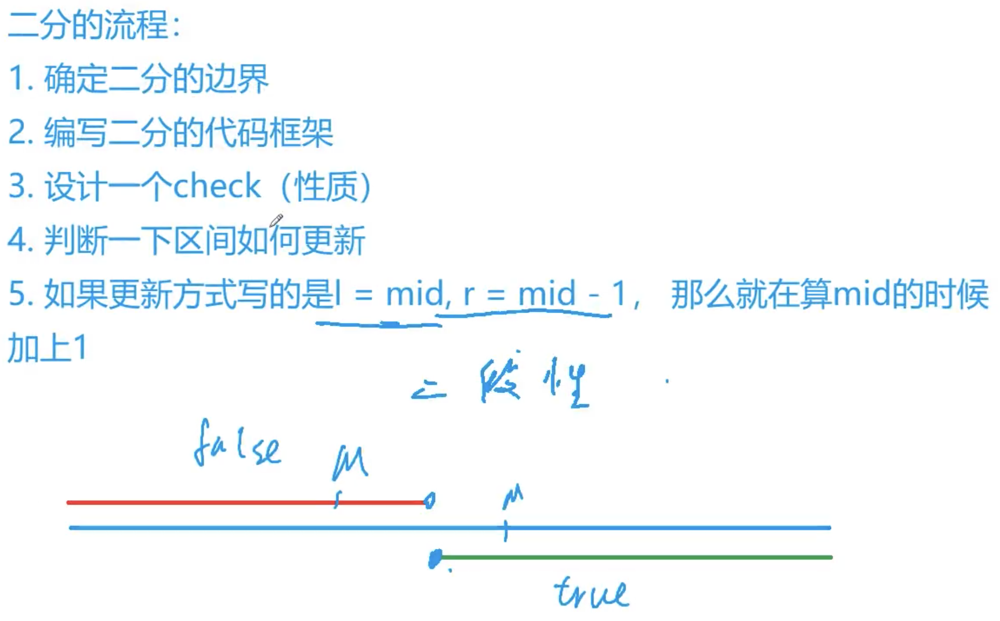

## 最基本思想
确认答案在某个区间，然后取其中点，比较和答案的区别，然后确定答案在中点两边的某个区间（即舍弃了一半的区间），重复取中，舍弃操作，直到区间只剩下一个元素（整数二分）

## 二分题目的关键元素

二分的流程:

1. 确定二分的边界 ^8679ee
2. 编写二分的代码框架
3. 设计一个check (性质)
4. 判断一下区间如何更新
5. 如果更新方式写的是I = mid,r = mid- 1，那么就在算mid的时候加上1

^120961

