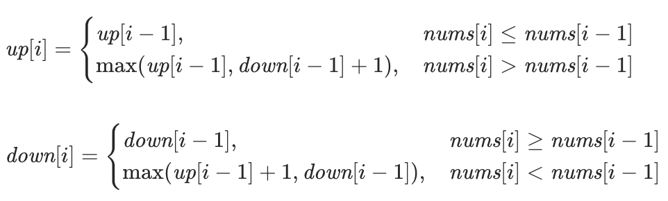

# 摆动序列  

链接: [leetcode-cn.com/problems/wiggle-subsequence/][1]  
[[动态规划]]
[[线性dp]]
## 贪心  

链接: [算法-贪心.itmz][2]  

## 动态规划  

### 状态  

* 表示  : [[f(i)]]
    * `up[i]`表示前i个数中，以某个数结尾的上升摆动序列的所有集合（最后一个数大于倒数第二个数），属性为最大长度。`down[i]`为下降摆动序列  
* 计算  
    * 不包含a[I]的时候为，up[i-1]，包含的时候为a[I]>a[i-1]，为`max(up[i], down[i - 1] +1)`注意这里为什么要用down[i - 1]来加1比较，因为我们找到的是大于上一个数的数，我们的上升序列此时已经上升的了，还要形成一个上升的序列，只能用下降序列来加1了。  
    * 后记：为什么可以用前一个下降的状态来表示来加1得到最大升序状态：因为我们的dp里面存的都是[最优的状态]，前一个下降子序列一定是极值，一定是里面的极小值，那么他一定小于我们将要比较的值



### code  

* ```c++  
    class Solution {  
    public:  
        int up[100010] = {0}, down[100010] = {0};  
        int wiggleMaxLength(vector<int>& nums) {  
            int n = nums.size();  
            if(n < 2) return n;  
              
            up[0] = 1, down[0] = 1;  
            for(int i = 1; i  < n; i++){  
                if(nums[i] < nums[i-1]) down[i] = max(down[i - 1], up[i-1] + 1);  
                else if(nums[i] > nums[i-1]) up[i] = max(down[i - 1] +1, up[i - 1]);  
                else down[i] = down[i-1], up[i] = up[i-1];  
            }  
            return max(down[n-1], up[n-1]);  
        }  
    };  
    ```
  
* ```c++  
    class Solution {  
    public:  
        int wiggleMaxLength(vector<int>& nums) {  
            int n = nums.size();  
            if (n < 2) {  
                return n;  
            }  
            vector<int> up(n), down(n);  
            up[0] = down[0] = 1;  
            for (int i = 1; i < n; i++) {  
                if (nums[i] > nums[i - 1]) {  
                    up[i] = max(up[i - 1], down[i - 1] + 1);  
                    down[i] = down[i - 1];  
                } else if (nums[i] < nums[i - 1]) {  
                    up[i] = up[i - 1];  
                    down[i] = max(up[i - 1] + 1, down[i - 1]);  
                } else {  
                    up[i] = up[i - 1];  
                    down[i] = down[i - 1];  
                }  
            }  
            return max(up[n - 1], down[n - 1]);  
        }  
    };  
    ```

### 优化  

* 注意到方法一中，我们仅需要前一个状态来进行转移，所以我们维护两个变量即可。这样我们可以写出如下的代码：  
* ```c++  
    class Solution {  
    public:  
        int wiggleMaxLength(vector<int>& nums) {  
            int n = nums.size();  
            if (n < 2) {  
                return n;  
            }  
            int up = 1, down = 1;  
            for (int i = 1; i < n; i++) {  
                if (nums[i] > nums[i - 1]) {  
                    up = max(up, down + 1);  
                } else if (nums[i] < nums[i - 1]) {  
                    down = max(up + 1, down);  
                }  
            }  
            return max(up, down);  
        }  
    };  
    ```

[1]: https://leetcode-cn.com/problems/wiggle-subsequence/
[2]: ithoughts://open?path=%E7%AE%97%E6%B3%95-%E8%B4%AA%E5%BF%83.itmz&topic=6596DEBF-1642-4193-B001-70A484509FF2
