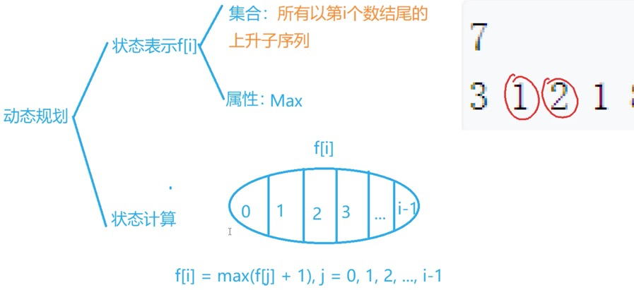
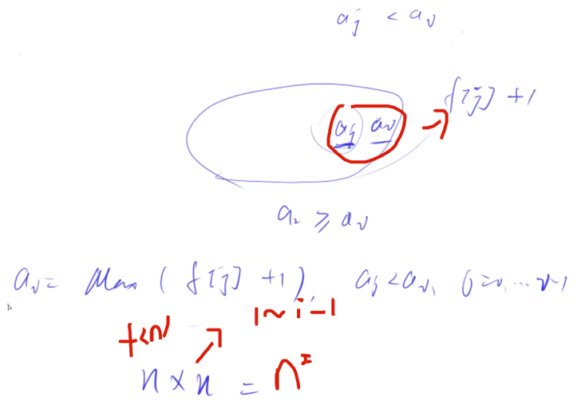

# 最长上升子序列

链接: [acwing.com/problem/content/897/][1]  
[[线性dp]][[动态规划]]

## 状态1  

### 表示  

* [[f(i)]]表示以第i个数为结尾的所有上升子序列，属性是最大长度  
  
### 计算  

* 因为根据表示，第`i`个位置一定是第i个数，其第`i-1`个位置的数是不确定的，所以将其分类为：第`i-1`不存在时（即那个上升子序列只有其本身）用0表示，然后第`i-1`个数可以为数组的第`1`~第`i-1`个数，`f[i] = f[i-1] + 1`  
  
### 图例  



* 
  
### 时间复杂度  

* N个状态，每个状态都要找到1~i-1，算n，则是[n^2]
  
## code

```c++
using namespace std;  
const int N = 1010;  
int a[N], f[N];  
int main(){  
    int n;  
    cin >> n;  
    for(int i = 1; i <= n; i++) cin >> a[i];  
    for(int i = 1; i <= n; i++){  
        f[i] = 1;  
        for(int j = 1; j < i; j++){  
            if(a[j] < a[i]) f[i] = max(f[i], f[j] + 1);  
        }  
    }  
    int res = 0;  
    for(int i = 1; i <= n; i++) res = max(res, f[i]);  
    cout << res;  
    return 0;  
}  
```

## 优化

记录`每个长度`的上升子序列中，记录最小的即可，因为我们能放在大的数后面的数，一定能放在小的数后面，而我们**要找的是最长上升子序列**，越小，我们能找到的越长的概率越大。

这样长度递增的过程中，最小的数也是递增的。why

* 反证法：如果j > I, aj <= ai的话，那么在aj中肯定有长度为i的点结尾最小的数比我们已经求出来的最小的数小  
* 保证有序，二分可用  
  

遍历每个点，找到其应该放的位置，更新，然后在这个过程中，找到最大的长度

更像贪心一点

### 记录

* Len存的是我们当前的最大长度，数组里面的元素个数  
  

### code

```c++
    #include <iostream>  
    using namespace std;  
    const int N = 100010;  
    int a[N], q[N];  
    int main(){  
        int n;  
        cin >> n;  
        for(int i = 0; i < n; i++) scanf("%d", &a[i]);  
        // len存的是最大长度，即q的当前容量，遍历完结束，就能看到我们在把所有数放进去之后的最大容量了  
        // 因为我们后面的数需要的长度都是看其放在哪一个位置，而不是递增的关系，和动态规划要求所有结果不大相关。  
        int len = 0;  
        q[0] = -2e9;  
        for(int i = 0 ; i < n ; i++){  
            int l = 0, r = len;  
            while(l < r){  
                int mid = l + r + 1 >> 1;  
                if(q[mid] < a[i]) l = mid;  
                else r = mid - 1;  
            }  
            len = max(len, r + 1);  
            cout << len << " "<<r << endl;  
            q[r + 1] = a[i];  
        }  
        cout << len << endl;  
        return 0;  
    }  
```

## 记录转移路径
[[记录路径]]

```c++
#include <iostream>  
using namespace std;  
const int N = 1010;  
int a[N], f[N], g[N];  
int main(){  
    int n;  
    cin >> n;  
    for(int i = 1; i <= n; i++) cin >> a[i];  
    for(int i = 1; i <= n; i++){  
        f[i] = 1;  
        g[i] = i;  
        for(int j = 1; j < i; j++){  
            if(a[j] < a[i]){  
                // 这里存的都是下标  
                if(f[i] < f[j] + 1){  
                    f[i] = f[j] + 1;  
                    // 记录其最大值是从哪里转移过来的  
                    g[i] = j;  
                }  
            }  
        }  
    }  
    int res = 0, k;  
    for(int i = 1; i <= n; i++){  
        if(f[i] > res){  
            res = f[i];  
            k = i;  
        }  
    }  
    cout << f[k] << endl;  
    for(int i = 0, len = f[k]; i < len; i++){  
        // 输出的是对应的数  
        printf("%d ", a[k]);  
        k = g[k];  
    }  
    // cout << res;  
    return 0;  
}  
```

  
  
[1]: https://www.acwing.com/problem/content/897/  
