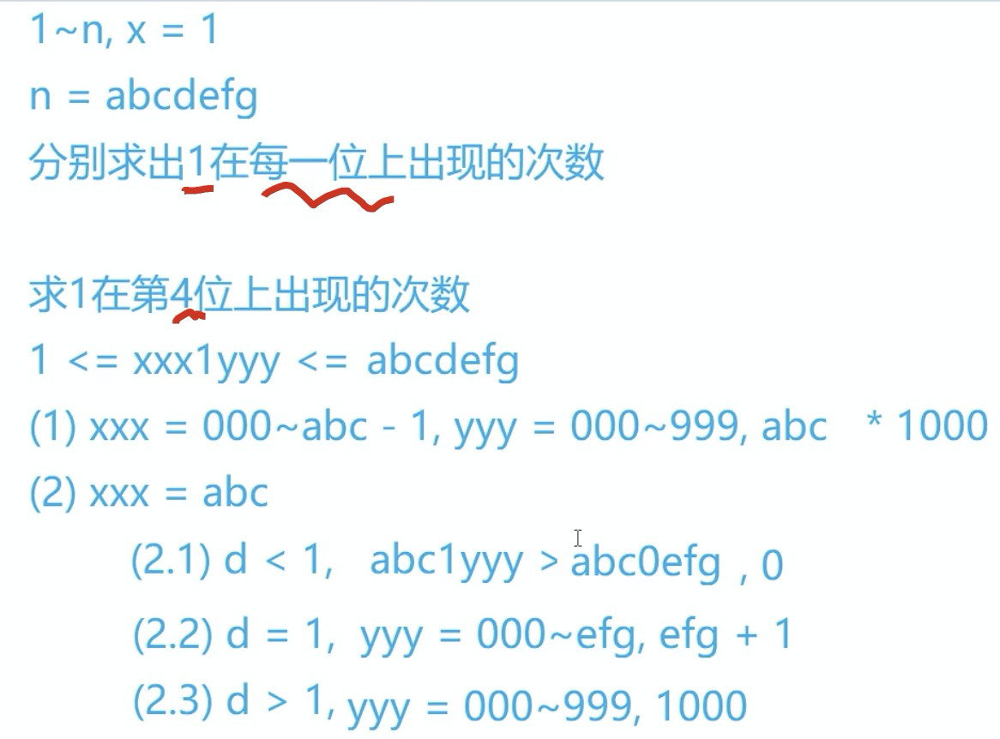

# 计数问题  

链接: [acwing.com/problem/content/340/][1]  
## 题目描述
给定两个整数 a 和 b，求 a 和 b 之间的所有数字中0~9的出现次数。

例如，a=1024，b=1032，则 a 和 b 之间共有9个数如下：

1024 1025 1026 1027 1028 1029 1030 1031 1032

其中‘0’出现10次，‘1’出现10次，‘2’出现7次，‘3’出现3次等等…

## [[分类讨论]]，非dp类解决方法 
一个数的个位、十位、百位拆开来讨论的类：将一个位的左边和右边分开讨论
[dfs解答](https://www.acwing.com/solution/content/6570/)
[dp解答](https://www.acwing.com/solution/content/4934/)
### 步骤

* 
* 1~n, i=1
 	n= abcdefg
eg: 
分别求出1在每一位上出现的次数
求1在第4位上出现的次数
 1 <= xxx1yyy <= abcdefg
(1)xxx=000~abc-1,yy000~, `abc*1000`
(2)xxx=abc
	2.1)d <1, abclyyy>abc0efg, `0`
	2.2)d=1,yyy = 000-efg, `efg + 1`
	2.3)d>1,yyy=000~999, `1000`
* 注意这里的第一种只有在求的`非0`在第`j`位出现的次数; 在求0在第j位的时候的时候，我们不能从`0`开始，我们要从`1`开始。cnt(n, i)`表示的是在1~n中，i出现的次数。
* 求[a, b]间`i`出现的次数，只要使用`cnt(b, i) - cnt(a-1, i)`即可，注意a要大于b哦。[[前缀和]]思想
* 当求的是0在第`j`位出现的次数的时候，因为我们的[[前缀不能为0]]
  
### code  

* ```C++  
    include <iostream>  
    include <cmath>  
    using namespace std;  
    // 求n的位数  
    int dgt(int n){  
        int cnt = 0;  
        while(n) ++cnt, n/=10;  
        return cnt;  
    }  
    // 求1~n中，i出现的次数  
    int cnt(int n, int i){  
        /*  
        abcd..., 求不等于的0的时候，求等于0的时候，只要左边不等于0，  
        当左边=abc的时候，第j个数的左边只要不为0，其它位置就能存放0，情况就和i不为0的时候一样  
        */  
        int d = dgt(n), res = 0;  
        // 从右到左，即从个位到高位  
        for(int j = 1; j <= d; j++){  
            // w为第j位的权重，l位第j位的左边，r位右边，dj位第j位的数字  
            int p = pow(10, j - 1), l = n/p/10, r = n % p, dj = n/p%10;  
            if(i) res += l * p;  
            if(!i && l) res += (l - 1) * p;  
            // 注意这里下面都是等于abc的情况,   
            if((dj > i) && (i || l)) res += p; //因为左边都固定了，所以加上权重即可（即右边任意，反正左边固定比他小  
            if((dj ==i) && (i || l)) res += (r + 1);  
        }  
        return res;  
    }  
    int main(){  
        int a, b;  
        while(cin >>a >> b, a){  
            if(a > b) swap(a, b);  
            for(int i = 0; i <= 9; i++) cout << cnt(b, i) - cnt(a - 1, i) << " ";  
            puts("");  
        }  
        return 0;  
    }  
    ```
	
## [[动态规划]]
[[todo]]

## 心得  

### 写一个代码  

* 先写出要做什么的具体步骤  
* 写出各个步骤的代码，不能将就，将就就真的不会了  
  

[1]: https://www.acwing.com/problem/content/340/